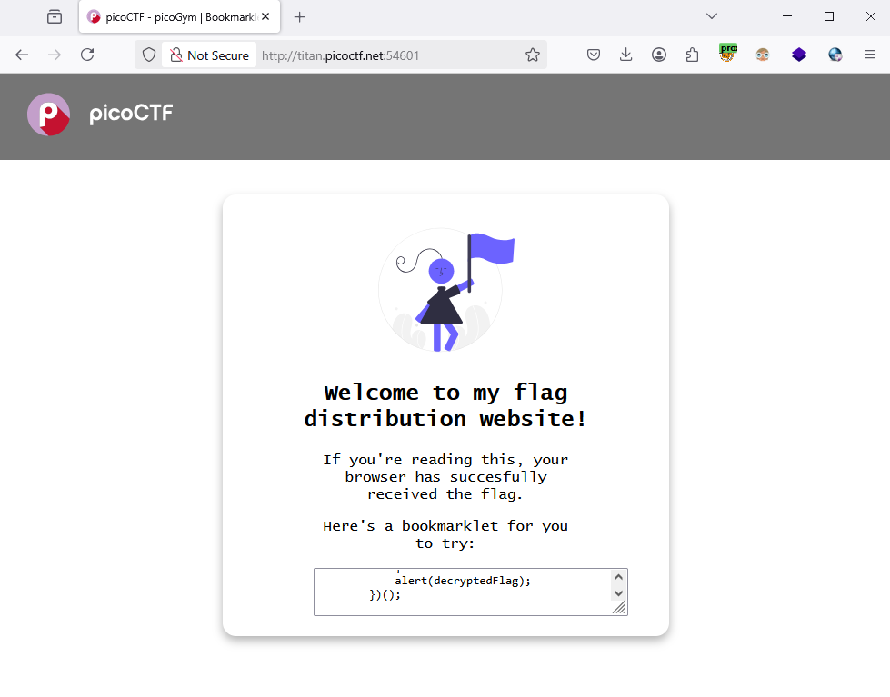
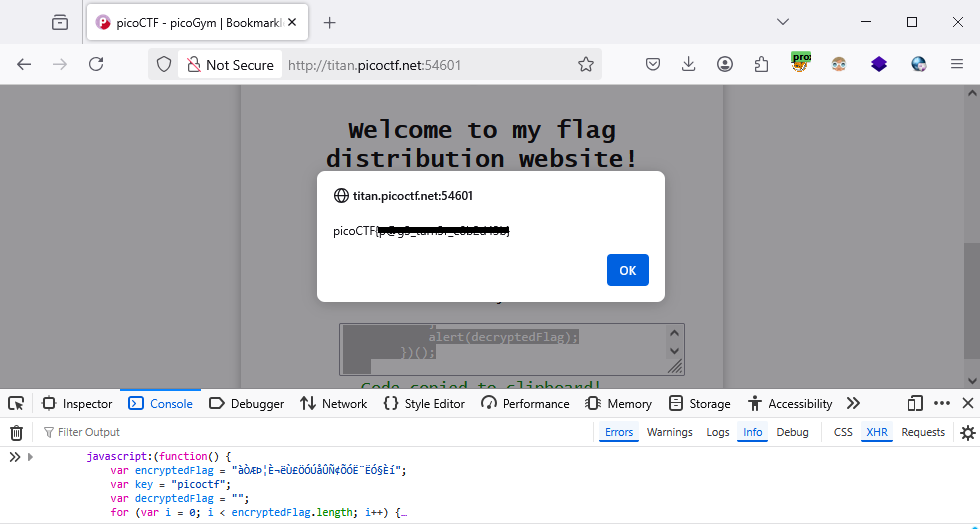

### Bookmarklet - Challenge 406

Access this lab



We saw the bookmarklet script, copy and paste it to `f12` - > `Console` tab, we got `flag`
```js
        javascript:(function() {
            var encryptedFlag = "àÒÆަȬë٣֖ÓÚåÛÑ¢ÕÓ˨˕ӗ§Èí";
            var key = "picoctf";
            var decryptedFlag = "";
            for (var i = 0; i < encryptedFlag.length; i++) {
                decryptedFlag += String.fromCharCode((encryptedFlag.charCodeAt(i) - key.charCodeAt(i % key.length) + 256) % 256);
            }
            alert(decryptedFlag);
        })();
    
```




I don't know why these lab too much time (30 min per 1 instance)