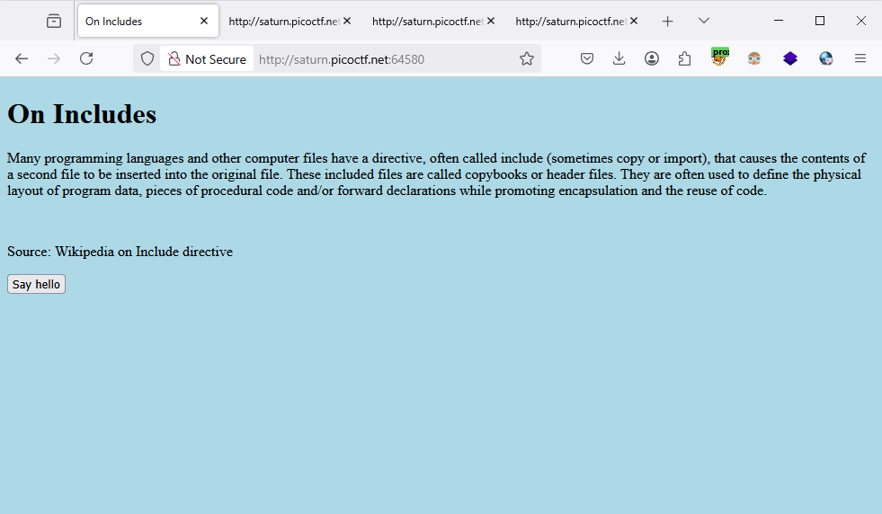
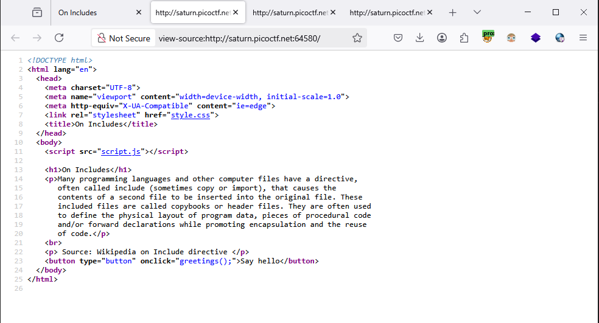
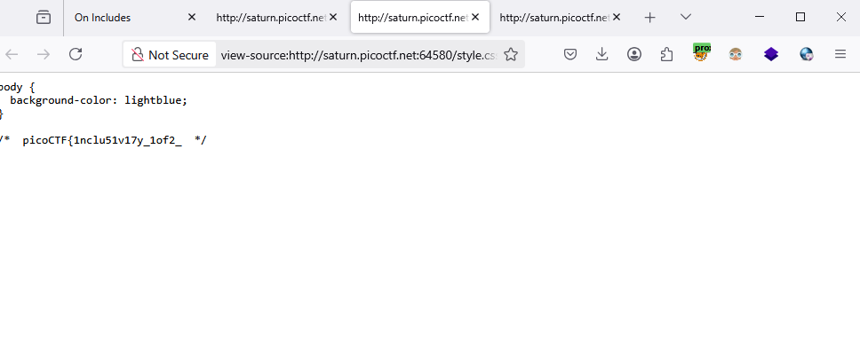

### Includes - Challenge 274

Access to the webpage

Go inspect this webpage to find some clue

Nothing here but we just trace to statics file like (css, js, ...)

WE got flag on 2 sperate file `css` and `script`

and the other half in `script` file