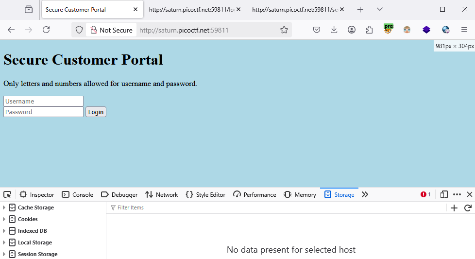
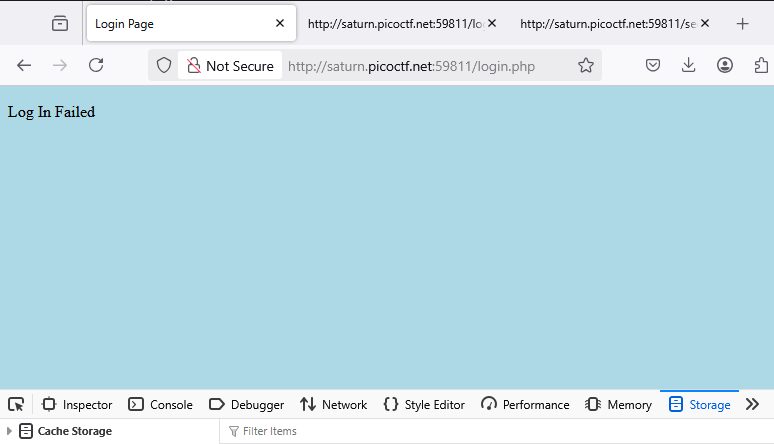
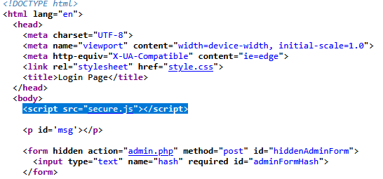
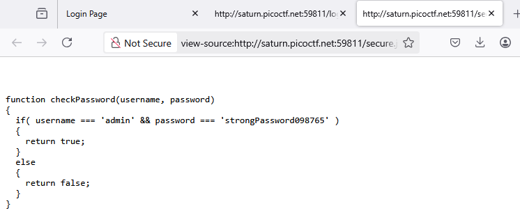
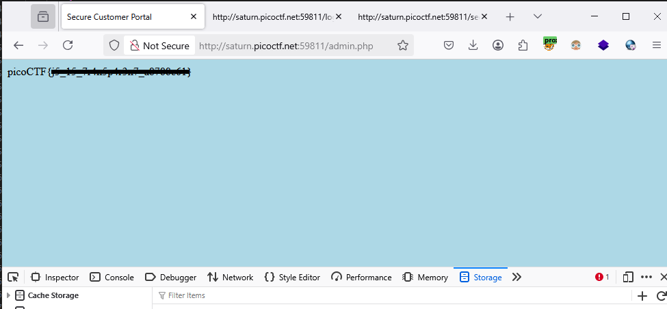

### Local Authority - Challenge 278

Access the lab page



let login using `aaa` and `aaa`, login failed



Try to inspect this web page, got `script` to filter username and password is valid or not.

```js
    <script type="text/javascript">
      function filter(string) {
        filterPassed = true;
        for (let i =0; i < string.length; i++){
          cc = string.charCodeAt(i);
          
          if ( (cc >= 48 && cc <= 57) ||
               (cc >= 65 && cc <= 90) ||
               (cc >= 97 && cc <= 122) )
          {
            filterPassed = true;     
          }
          else
          {
            return false;
          }
        }
        
        return true;
      }
    
      window.username = "a";
      window.password = "a";
      
      usernameFilterPassed = filter(window.username);
      passwordFilterPassed = filter(window.password);
      
      if ( usernameFilterPassed && passwordFilterPassed ) {
      
        loggedIn = checkPassword(window.username, window.password);
        
        if(loggedIn)
        {
          document.getElementById('msg').innerHTML = "Log In Successful";
          document.getElementById('adminFormHash').value = "2196812e91c29df34f5e217cfd639881";
          document.getElementById('hiddenAdminForm').submit();
        }
        else
        {
          document.getElementById('msg').innerHTML = "Log In Failed";
        }
      }
      else {
        document.getElementById('msg').innerHTML = "Illegal character in username or password."
      }
    </script>
```
but we don't find any clue on this script

Look around, this script



we got username and password be harded on this js file, login it



Login Successful and website throw flag

