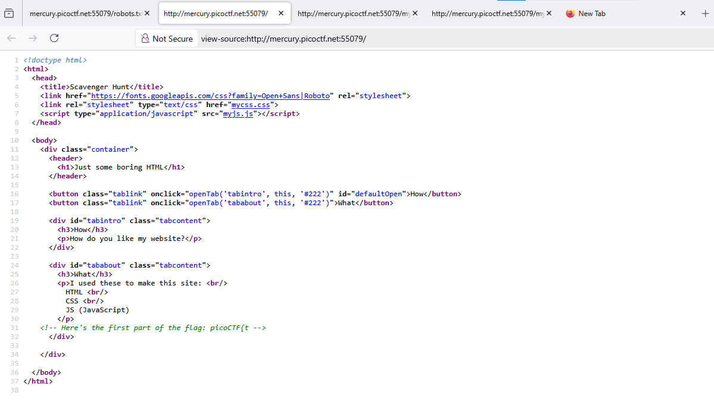
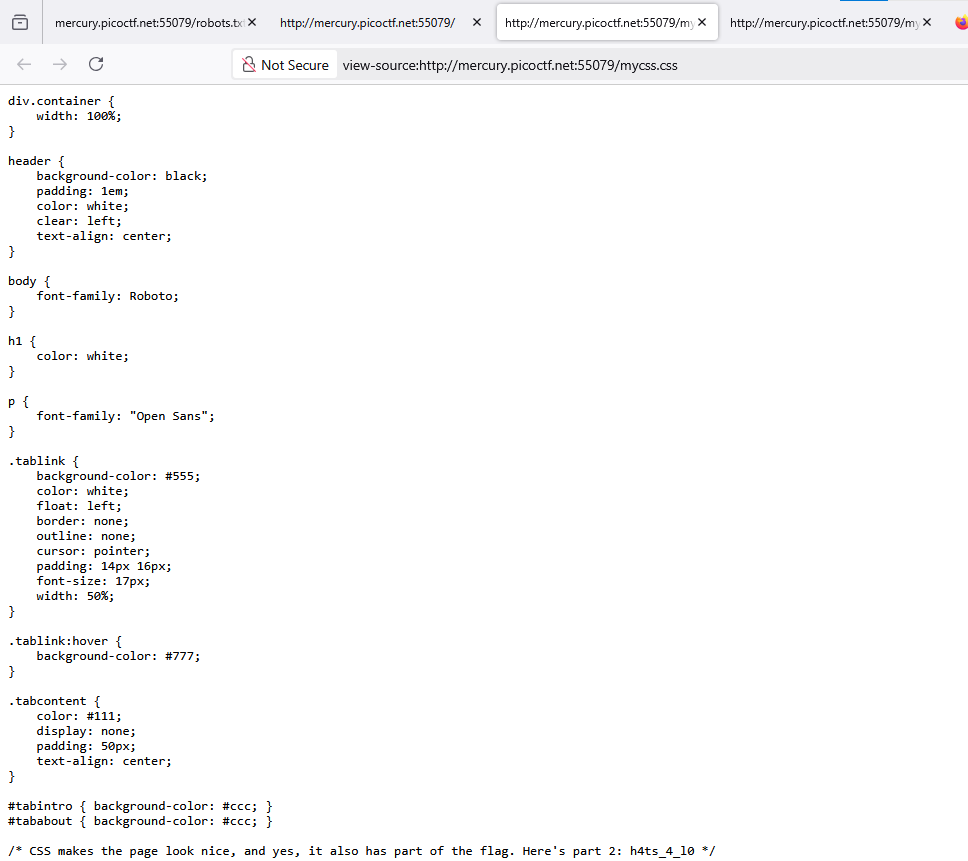
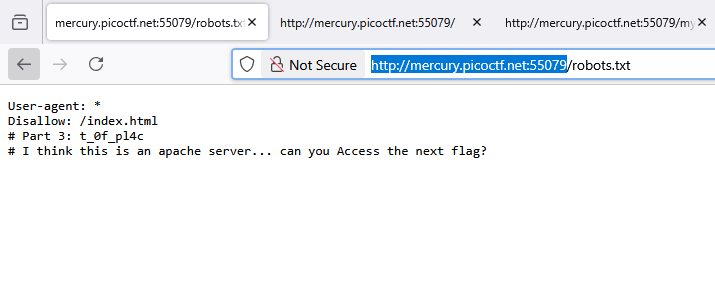
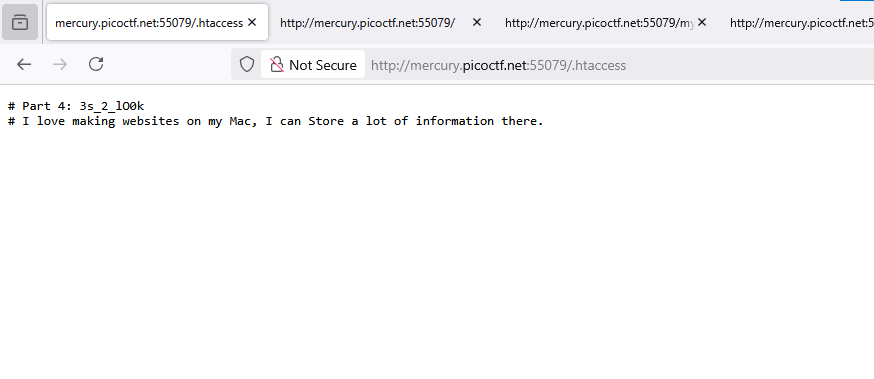
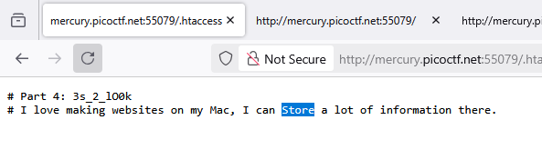
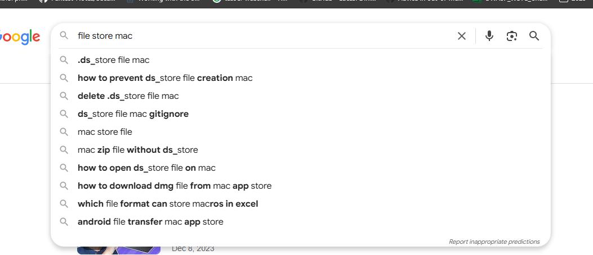

### Scavenger hunt - Challenge 161

Access the web, just inspect web, got first clue

Next, we try to inspect `mycss.css` and `myjs.js`, got second clue on `mycss.css`

on `myjs.js`, we got clue `/* How can I keep Google from indexing my website? */`

It's mean go to `/robots.txt` and we got third clue

Merge 3 pieces we got a flag

Still a clue to complete flag of this challenge

`apache`, we try to some hidden file like `.htaccess` default of apache server

, got clue 4,

Searching on google for this information, got 

Next go `.DS_Store` for default MAC folder, got final clue

Merge 5 clue, got a flag

