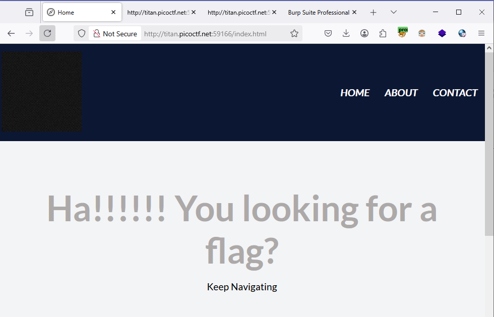
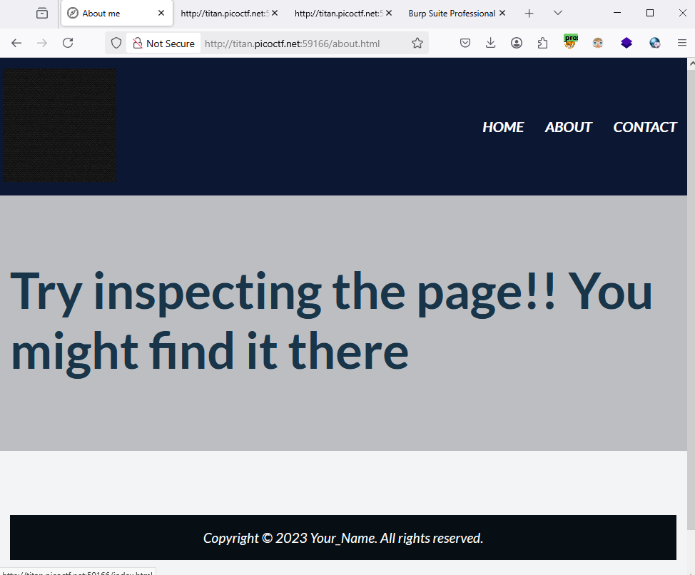
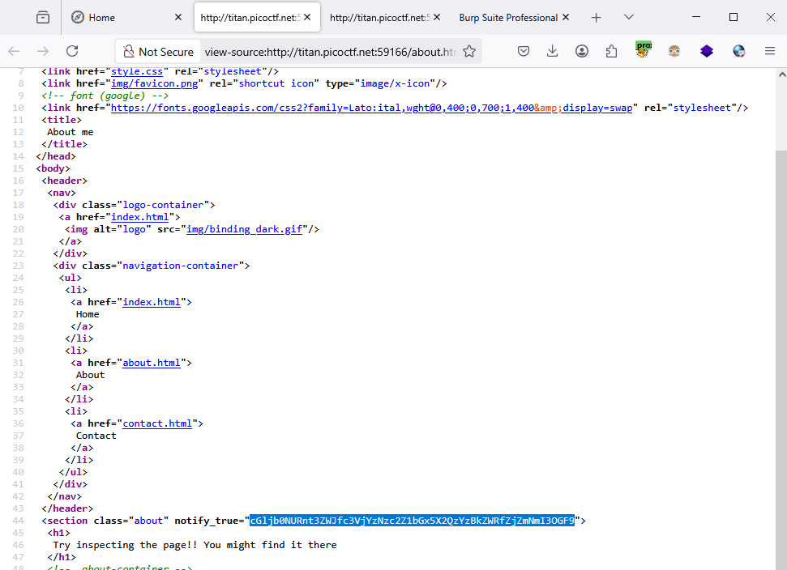
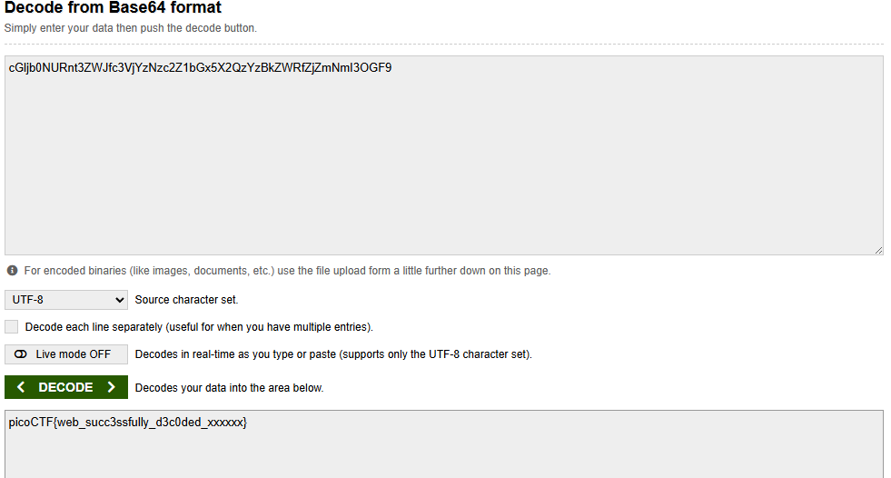

### WebDecode - challenge 427

This is homepage

Navigating to About tab, they told we can find somethings here wiht inspect web

Let's View Source this page, we got a code like `base64`

Decode this, we got `flag`

