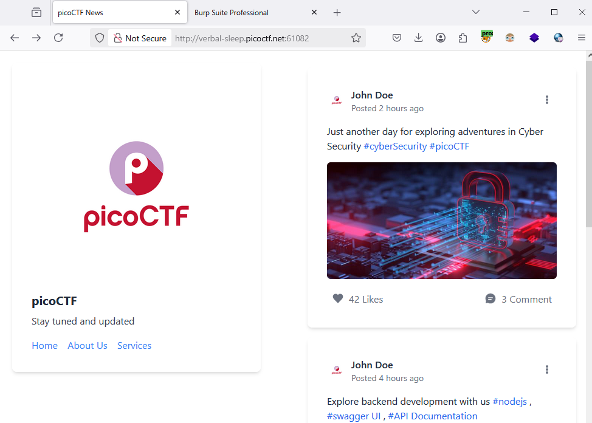
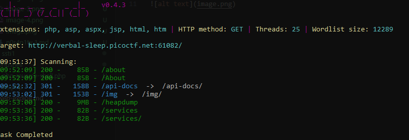
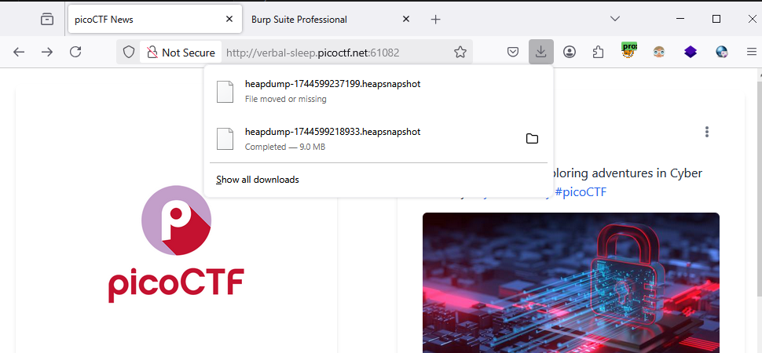
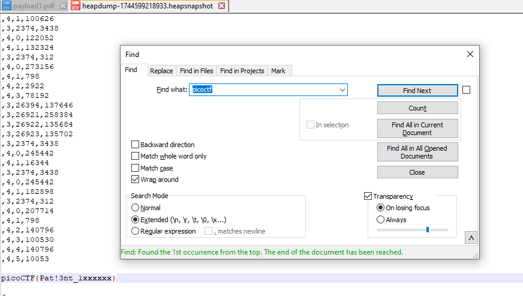

### head-dump - Challenge 476

Access to the lab, this is homepage.

Maybe somehting hidden, using `dirsearch` to bruteforce, we got some:

=> heapdump 9mb, it's maybe containt some clue on it

Try download 

Open with text editor, find with `picoctf` we got `flag`

