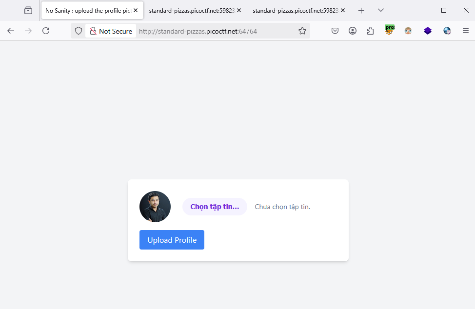
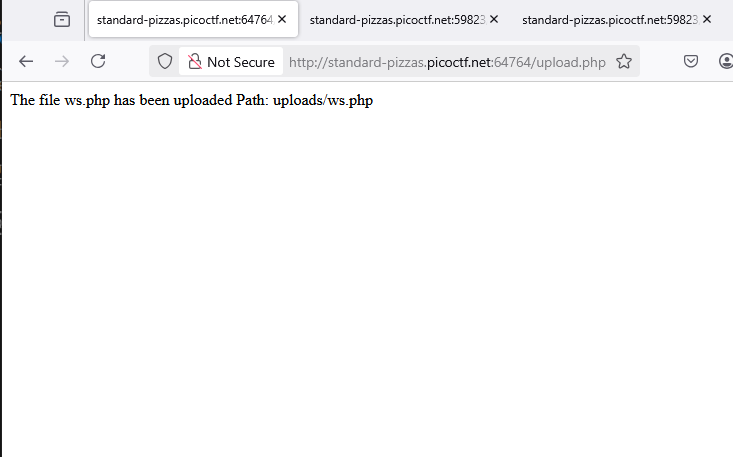
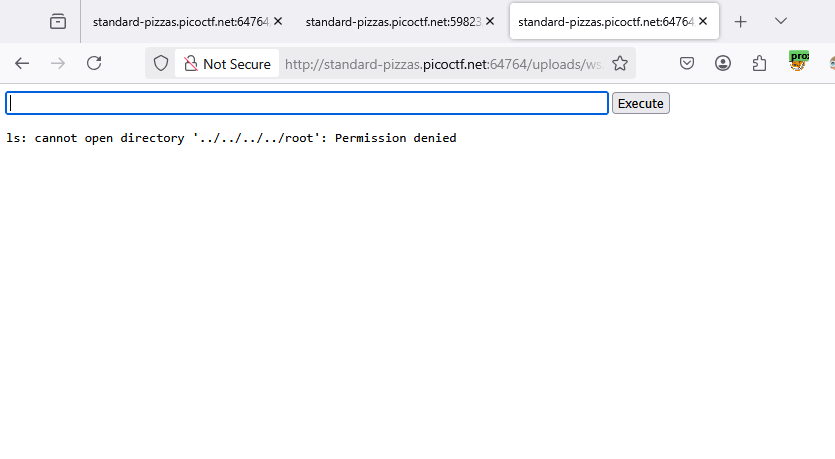
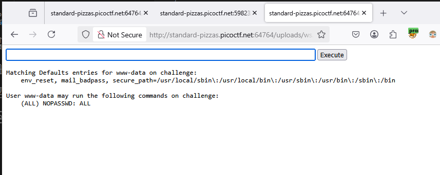
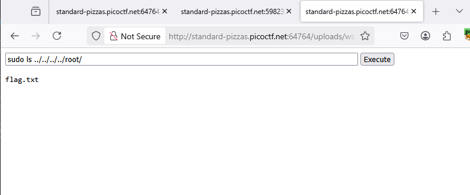

### n0s4n1ty 1 - Challenge 482

Access to the lab

Go to upload file php [webshell](/web-exploitation/phpshell/ws.php), 

Upload webshell successfully, this function was not sanitized.

try access to `/root` location

> ls ../../../../root

=> Permission denied

Try `sudo -l`,We can use sudo without password

let `sudo ls ../../../../root`, see `flag.txt`

let cat flag.txt with sudo, we got flag 
