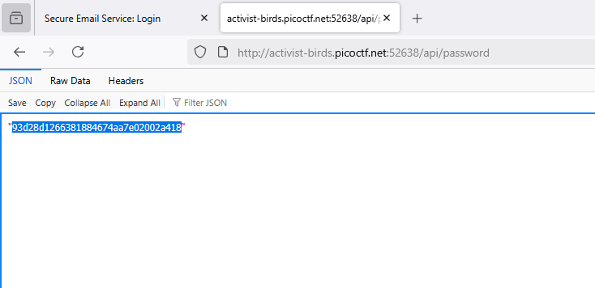
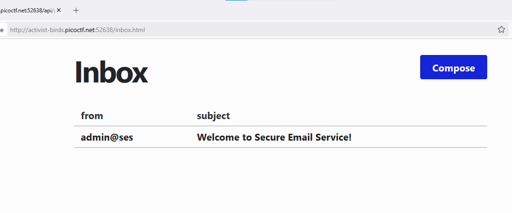
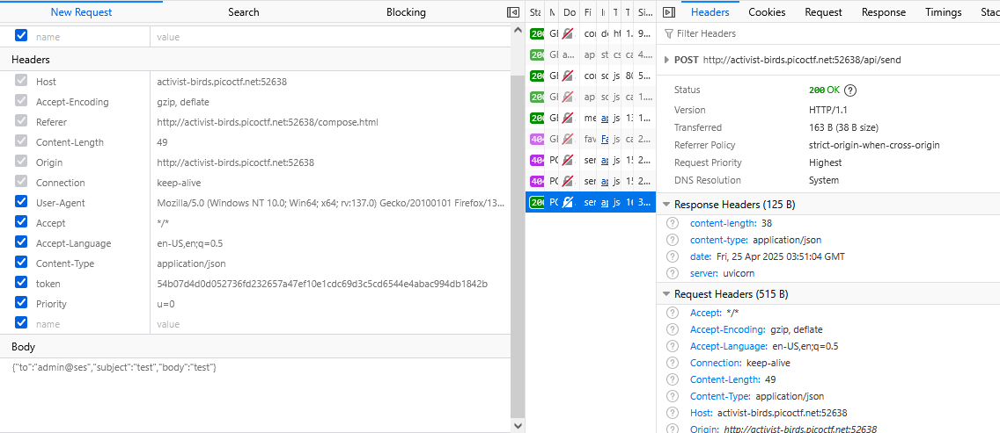
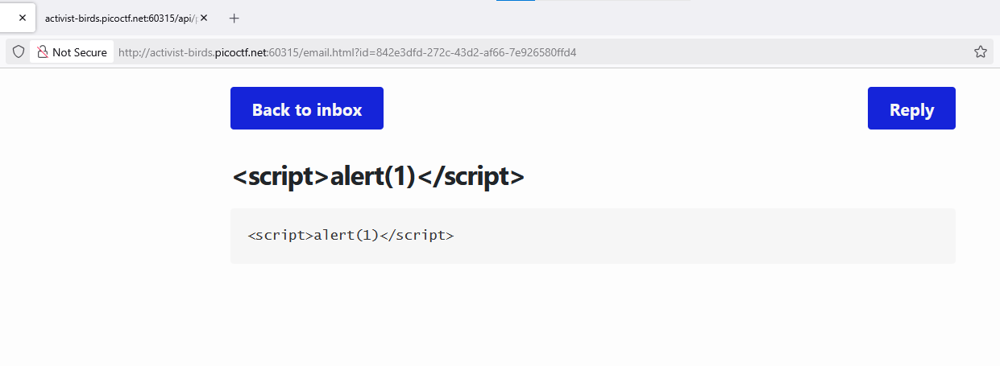

### secure-email-service Challenge 496

Access the lab page, 

Check on `main.py` 

```python
#\secure-email-service\secure-email-service\main.py:112-114
@app.get('/api/password')
async def password():
	return await db.get_user_password()
```

got route `@app.get('/api/password')`, when access the `/api/password`

this program will `await` this function `db.get_user_password()`, let inspect this

on `db.py`

```python
# secure-email-service\secure-email-service\db.py:81-85
async def get_user_password():
	if await r.get('seen_password') is not None:
		return 'already seen'
	await r.set('seen_password', 1)
	return (await get_user('user@ses')).password
```

this function will throw password of user@ses if i visit this api 1 times, so

get the `password` for the first time at `api/password`



login with `user@ses` and password from `api/password`



sent test mail for `admin@ses` (i take it from source code)



Try to sent to `user@ses`, got email but script xss not work




