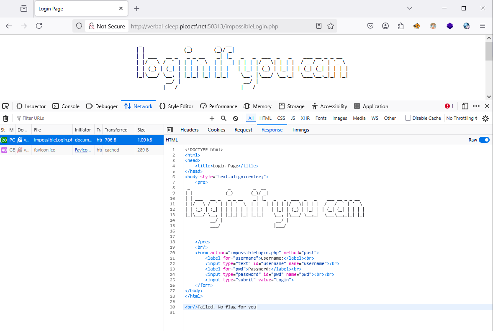
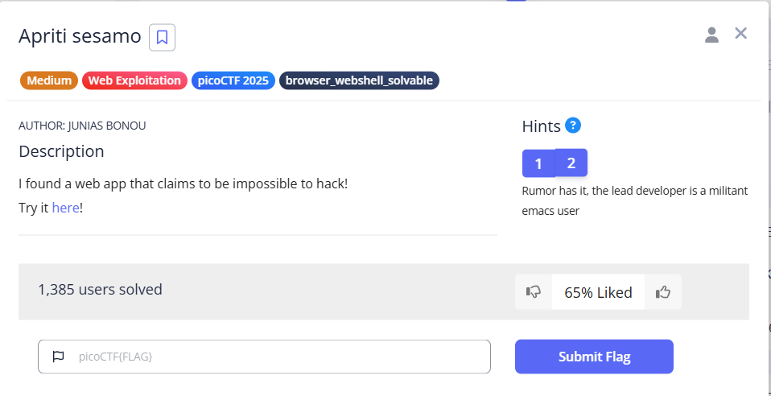
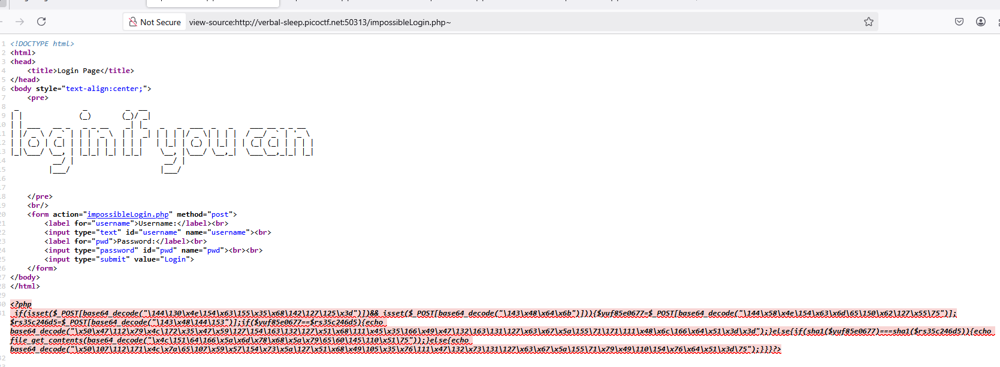
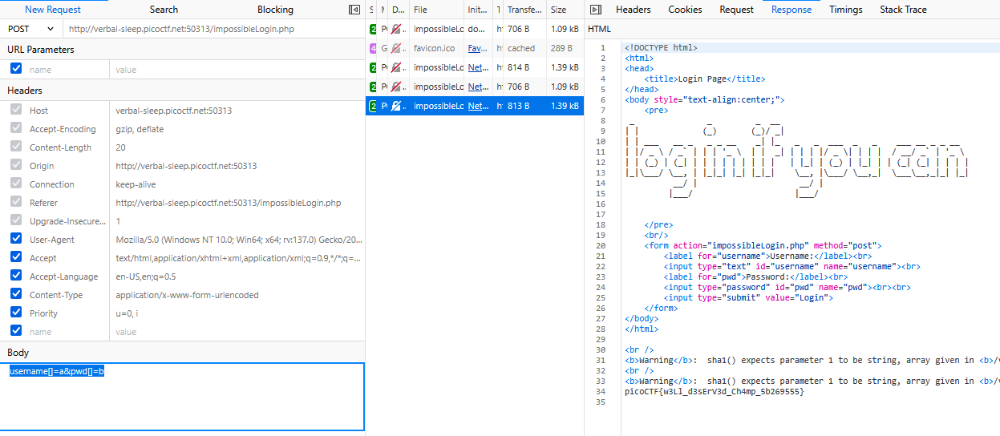

### Apriti sesamo | Challenge 467

access the lab, try login with `admin|admin`



hint 2



find some useful `emacs` backup file `~`

found `php` code but it encrpted



```php
<?php
 if(isset($_POST[base64_decode("\144\130\x4e\154\x63\155\x35\x68\142\127\125\x3d")])&& isset($_POST[base64_decode("\143\x48\x64\x6b")])){$yuf85e0677=$_POST[base64_decode("\144\x58\x4e\154\x63\x6d\65\150\x62\127\x55\75")];$rs35c246d5=$_POST[base64_decode("\143\x48\144\153")];if($yuf85e0677==$rs35c246d5){echo base64_decode("\x50\x47\112\x79\x4c\172\x35\x47\x59\127\154\163\132\127\x51\x68\111\x45\x35\166\x49\x47\132\163\131\127\x63\x67\x5a\155\71\171\111\x48\x6c\166\x64\x51\x3d\x3d");}else{if(sha1($yuf85e0677)===sha1($rs35c246d5)){echo file_get_contents(base64_decode("\x4c\151\64\166\x5a\x6d\x78\x68\x5a\x79\65\60\145\110\x51\75"));}else{echo base64_decode("\x50\107\112\171\x4c\x7a\65\107\x59\x57\154\x73\x5a\127\x51\x68\x49\105\x35\x76\111\x47\132\x73\131\127\x63\x67\x5a\155\71\x79\x49\110\154\x76\x64\x51\x3d\75");}}}?>
```

decode it
```bash
C:\Users\drillh>python
Python 3.11.0 (main, Oct 24 2022, 18:26:48) [MSC v.1933 64 bit (AMD64)] on win32
Type "help", "copyright", "credits" or "license" for more information.

>>> b64decode("\144\130\x4e\154\x63\155\x35\x68\142\127\125\x3d").decode
<built-in method decode of bytes object at 0x000001F24FB471B0>
>>> b64decode("\144\130\x4e\154\x63\155\x35\x68\142\127\125\x3d").decode()
'username'
>>> b64decode("\143\x48\x64\x6b").decode()
'pwd'
>>>
>>> b64decode("\144\x58\x4e\154\x63\x6d\65\150\x62\127\x55\75").decode()
'username'
>>> b64decode("\143\x48\144\153").decode()
'pwd'
>>> b64decode("\x50\x47\112\x79\x4c\172\x35\x47\x59\127\154\163\132\127\x51\x68\111\x45\x35\166\x49\x47\132\163\131\127\x63\x67\x5a\155\71\171\111\x48\x6c\166\x64\x51\x3d\x3d").decode()
'<br/>Failed! No flag for you'
>>> b64decode("\x4c\151\64\166\x5a\x6d\x78\x68\x5a\x79\65\60\145\110\x51\75").decode()
'../flag.txt'
>>> b64decode("\x50\107\112\171\x4c\x7a\65\107\x59\x57\154\x73\x5a\127\x51\x68\x49\105\x35\x76\111\x47\132\x73\131\127\x63\x67\x5a\155\71\x79\x49\110\154\x76\x64\x51\x3d\75").decode()
'<br/>Failed! No flag for you'
```
php complete code

```php
 if(isset($_POST['username'])&& isset($_POST['pwd']))
 {
 $yuf85e0677=$_POST['username'];
 $rs35c246d5=$_POST['pwd'];
 if($yuf85e0677==$rs35c246d5)
    {
        echo '<br/>Failed! No flag for you';
    }
    else
    {
        if(sha1($yuf85e0677)===sha1($rs35c246d5))
            {
                echo file_get_contents('../flag.txt');
            }
        else
            {
                echo '<br/>Failed! No flag for you';
            }
    }
}
 ?>
```
Write a `script` bypass with `SHAttered`

reference: [SHA1 Hash Collision Attack](https://exploit-notes.hdks.org/exploit/cryptography/algorithm/sha1-hash-collision-attack/)

or jusst bypass using manipulation `username and pwd` on request(why? if using `[]`, PHP wil hash `array` not `value in array`, maybe it's bypass `===`)



got flag


