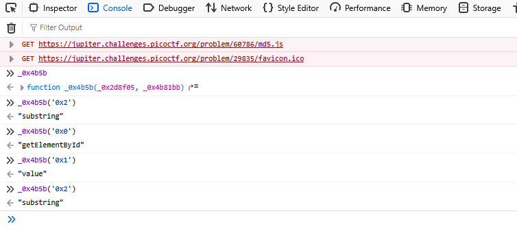

#### Client-side-again Challenge 69

Access the lab, view source, got script


```js
  var _0x5a46 = ['f49bf}', '_again_e', 'this', 'Password\x20Verified', 'Incorrect\x20password', 'getElementById', 'value', 'substring', 'picoCTF{', 'not_this'];
  (function(_0x4bd822, _0x2bd6f7) {
      var _0xb4bdb3 = function(_0x1d68f6) {
          while (--_0x1d68f6) {
              _0x4bd822['push'](_0x4bd822['shift']());
          }
      };
      _0xb4bdb3(++_0x2bd6f7);
  }(_0x5a46, 0x1b3));
  var _0x4b5b = function(_0x2d8f05, _0x4b81bb) {
      _0x2d8f05 = _0x2d8f05 - 0x0;
      var _0x4d74cb = _0x5a46[_0x2d8f05];
      return _0x4d74cb;
  };

  function verify() {
      checkpass = document[_0x4b5b('0x0')]('pass')[_0x4b5b('0x1')];
      split = 0x4;
      if (checkpass[_0x4b5b('0x2')](0x0, split * 0x2) == _0x4b5b('0x3')) {
          if (checkpass[_0x4b5b('0x2')](0x7, 0x9) == '{n') {
              if (checkpass[_0x4b5b('0x2')](split * 0x2, split * 0x2 * 0x2) == _0x4b5b('0x4')) {
                  if (checkpass[_0x4b5b('0x2')](0x3, 0x6) == 'oCT') {
                      if (checkpass[_0x4b5b('0x2')](split * 0x3 * 0x2, split * 0x4 * 0x2) == _0x4b5b('0x5')) {
                          if (checkpass['substring'](0x6, 0xb) == 'F{not') {
                              if (checkpass[_0x4b5b('0x2')](split * 0x2 * 0x2, split * 0x3 * 0x2) == _0x4b5b('0x6')) {
                                  if (checkpass[_0x4b5b('0x2')](0xc, 0x10) == _0x4b5b('0x7')) {
                                      alert(_0x4b5b('0x8'));
                                  }
                              }
                          }
                      }
                  }
              }
          }
      } else {
          alert(_0x4b5b('0x9'));
      }
  }
```

Using console develop to decode this



```js
  function verify() {
      checkpass = document[getElementById]('pass')[value];
      split = 4;
      if (checkpass['substring'](0, split * 2) == "picoCTF{") {
          if (checkpass['substring'](7, 9) == '{n') {
              if (checkpass['substring'](split * 2, split * 2 * 2) == 'not_this') {
                  if (checkpass['substring'](3, 6) == 'oCT') {
                      if (checkpass['substring'](split * 3 * 2, split * 4 * 2) == 'f49bf}') {
                          if (checkpass['substring'](6, 11) == 'F{not') {
                              if (checkpass['substring'](split * 2 * 2, split * 3 * 2) == '_again_e') {
                                  if (checkpass['substring'](12, 16) == 'this') {
                                      alert('Password Verified');
                                  }
                              }
                          }
                      }
                  }
              }
          }
      } else {
          alert(''Incorrect password));
      }
  }
```
picoCTF{