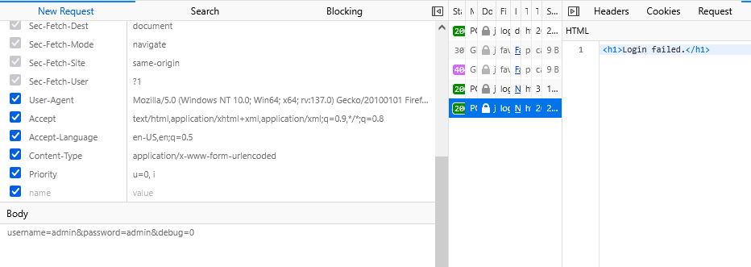
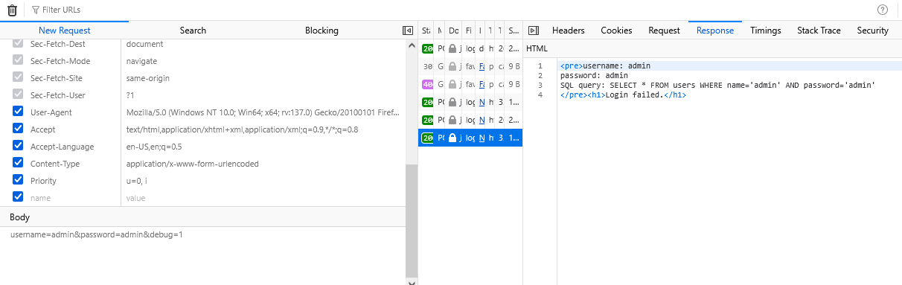
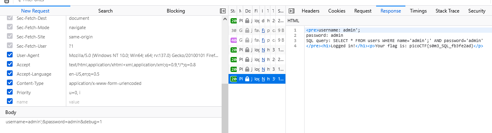

### Irish-Name-Repo 1 Challenge 80

Access the lab, capture request login

body with `username=admin&password=admin&debug=0`, next, modify debug to 1, i can see query

using break query got flag

