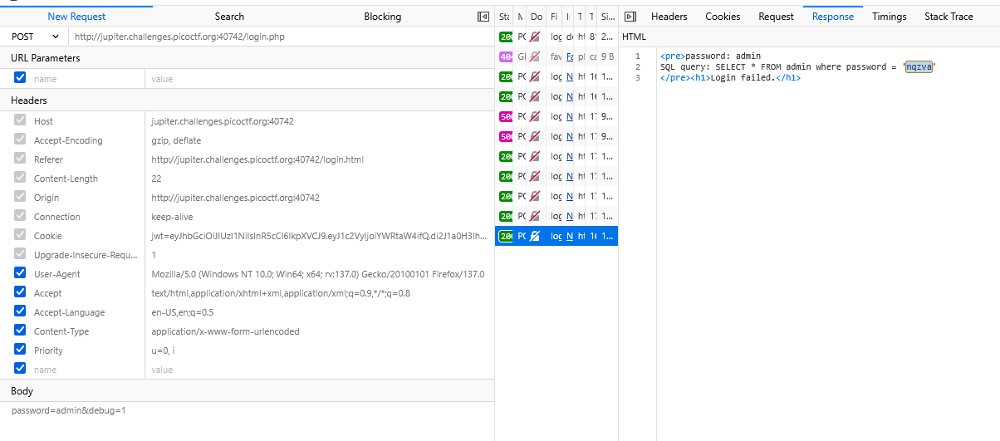
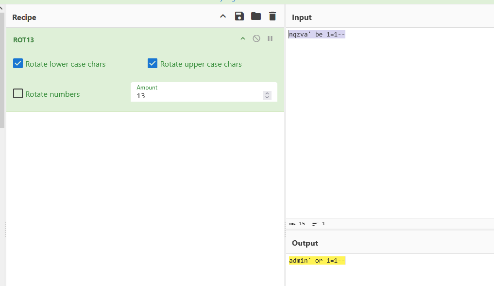
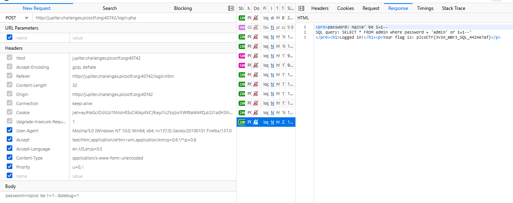

### Irish-Name-Repo 3 Challenge 8

Access the lab, capture request `POST`-login, enable `debug=1`

hit `admin` on query `nqzva`

let check 

A-B-C-D-E-F-G-H-I-J-K-L-M-N-O-P-Q-R-S-T-U-V-W-X-Y-Z

1-2-3-4-5-6-7-8-9-0-1-2-3-4-5-6-7-8-9-0-1-2-3-4-5-6
`a` to `n` is `13`

`d` to `q` is `13`
...

may be it's encrypted `shift` 13, so encode payload with `ROT13`

go cyberchef

got flag

