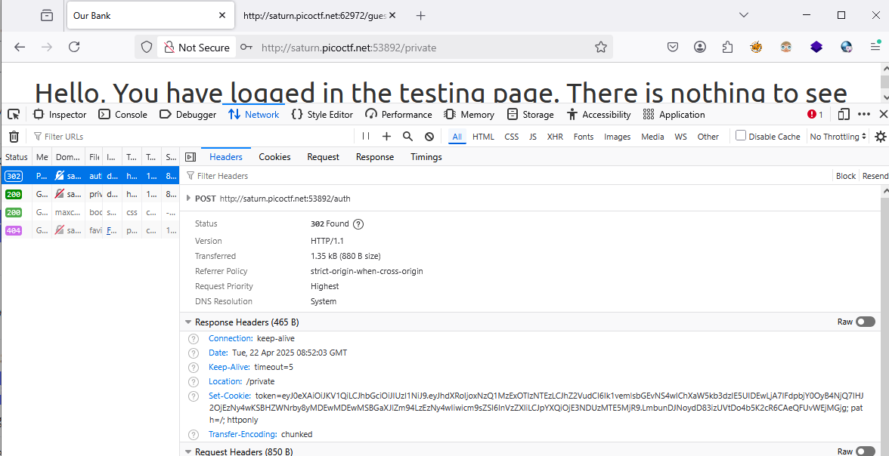
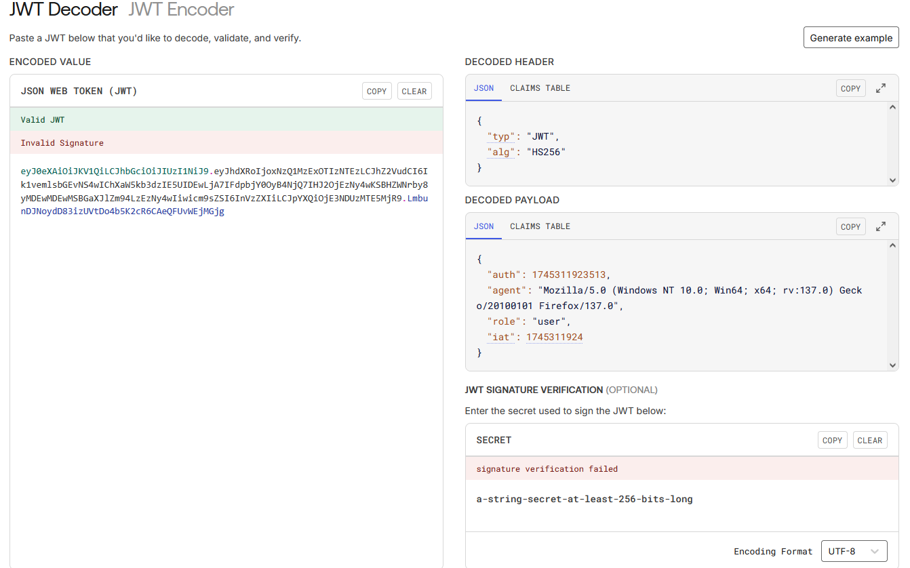
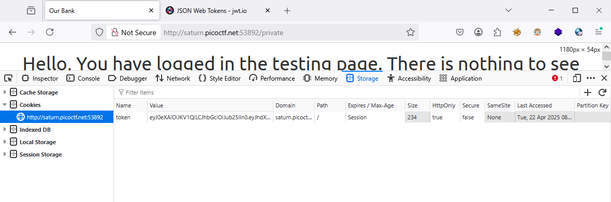
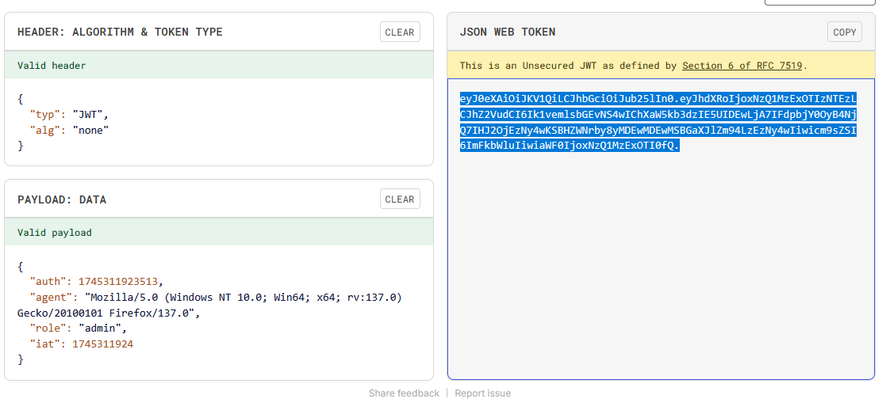
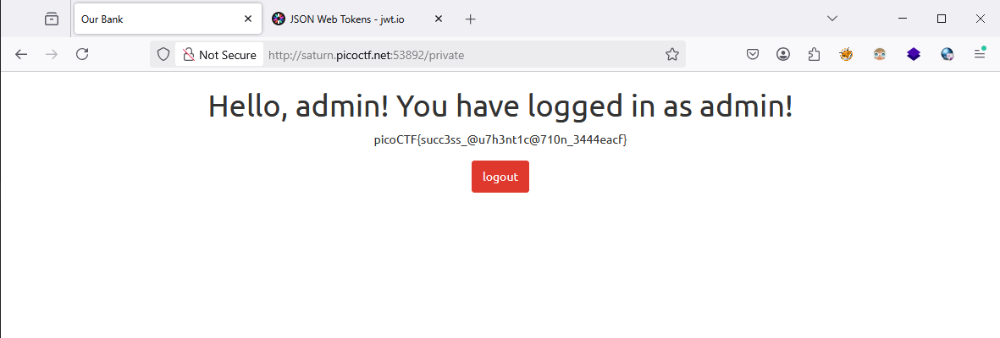

### JAuth Challenge 236

ACcess the lab, login and got `jwt`

Check it on jwt.io, it's using `hmacsha256`,

Try to `none` alg and let check jwt is valid or not

Opps, it still avalable, so we confirm it signed self 

let try to `admin`

and we got

