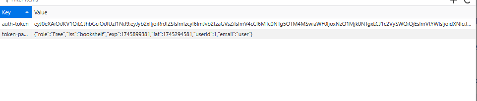
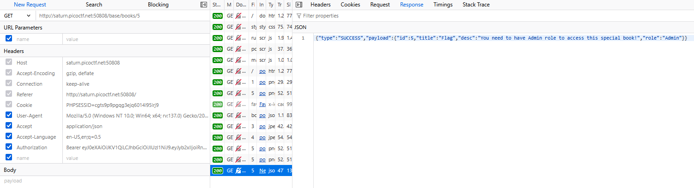
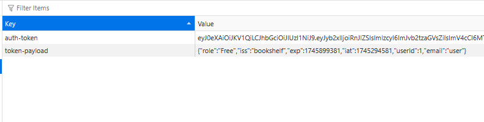
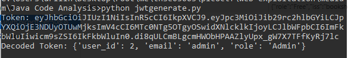
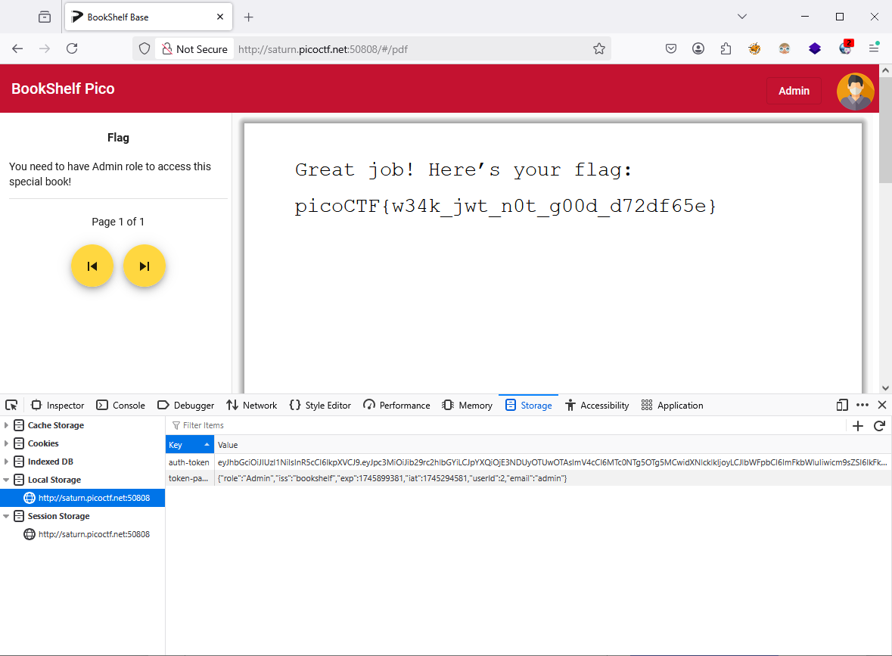

### Java Code Analysis Challenge 355

Now we got source `boookshelf pico`, let's dig in

Firstly, when logon system bookshelf, we got `search` function, trace it on code

```java
//BookController.java (54-59)

    @GetMapping("/books/search")
    public Response<List<BookDto>> searchBooks(@RequestParam("q") String query) {
        List<BookDto> bookDtoList = bookService.searchBook(query);
        return new Response<List<BookDto>>().setPayload(bookDtoList)
                .setType(ResponseType.SUCCESS);
    }
```

Nothing useful here

Try to read in turn, I found `SecretGenerator.java`, inspect it, got something

I know secret key is `1234`

```java
//bookshelf-pico\src\main\java\io\github\nandandesai\pico\security\SecretGenerator.java
//(21-24)

    private String generateRandomString(int len) {
        // not so random
        return "1234";
    }
```
When got secret , lookaround `security/models`, got `JwtService.java`, inspect its

On this file, we know how to `jwt` create

```java
//bookshelf-pico\src\main\java\io\github\nandandesai\pico\security\JwtService.java
//(30-44)

    public String createToken(Integer userId, String email, String role){
        Algorithm algorithm = Algorithm.HMAC256(SECRET_KEY);

        Calendar expiration = Calendar.getInstance();
        expiration.add(Calendar.DATE, 7); //expires after 7 days

        return JWT.create()
                .withIssuer(ISSUER)
                .withIssuedAt(new Date())
                .withExpiresAt(expiration.getTime())
                .withClaim(CLAIM_KEY_USER_ID, userId)
                .withClaim(CLAIM_KEY_EMAIL, email)
                .withClaim(CLAIM_KEY_ROLE, role)
                .sign(algorithm);
    }
```

With `secret key` leaked from `SecretGenerator.java`, Write a [python script](web-exploitation/medium/Java%20Code%20Analysis/jwtgenerate.py) 

Next, login on web,



On `localStorage`, saw jwt `auth-token` and `token-payload`

So, just modify this,

```python
#jwtgenerate.py(37-38)

token = jwt_service.create_token(1, "admin", "Admin")
print("Token:", token)
```

But still can't access the `flag` PDF file, 



Look around on `models`, got `Role.java`

```java
//bookshelf-pico\src\main\java\io\github\nandandesai\pico\models\Role.java
//(21-23)

    @Column
    private Integer value; //higher the value, more the privilege. By this logic, admin is supposed to
    // have the highest value
}
```
It mean `userId` higher value, more previllege, back to `localStorage` got `userId` of user is `1`



Change script to `userId` from script to `2`, and re-run script



and try it on `localStorage`, replace `auth-token` value to `token` value generated by script 

and `token-payload` is `{"role":"Admin","iss":"bookshelf","exp":1745899381,"iat":1745294581,"userId":2,"email":"admin"}`, got flag




