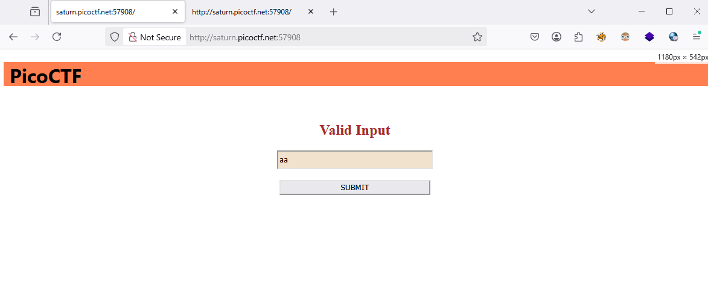

### MatchTheRegex Challenge 356

Access the lab, 



view source and look at script

```js
<script>
	function send_request() {
		let val = document.getElementById("name").value;
		// ^p.....F!?
		fetch(`/flag?input=${val}`)
			.then(res => res.text())
			.then(res => {
				const res_json = JSON.parse(res);
				alert(res_json.flag)
				return false;
			})
		return false;
	}

</script>
```

string find start with p and end with F

get `name` val from HTML input

send a `get` request with `fetch`

try exploit :
put `picoCTF` on input field

ez