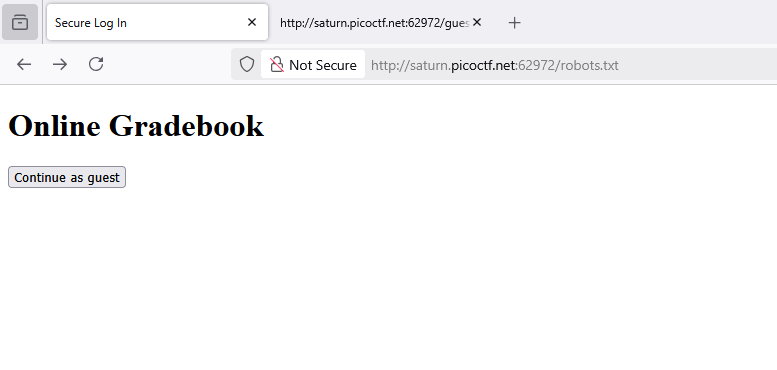
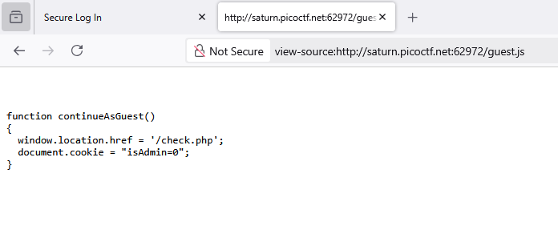

### Power Cookie Challenge 288

Access the webpage, see a button

Viewsource, check static file, a static file named `guest.js`

check around, got 

when press this button `document.cookie = "isAdmin=0";` was set cookie `isAdmin` with `0` value

go check `Cookies` modify value of `isAdmin` to `1`. Press button again and got `flag`