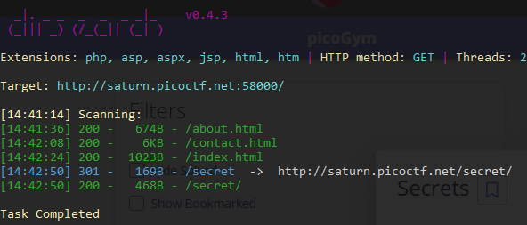
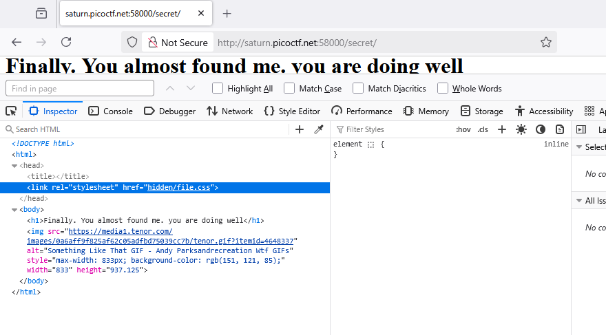
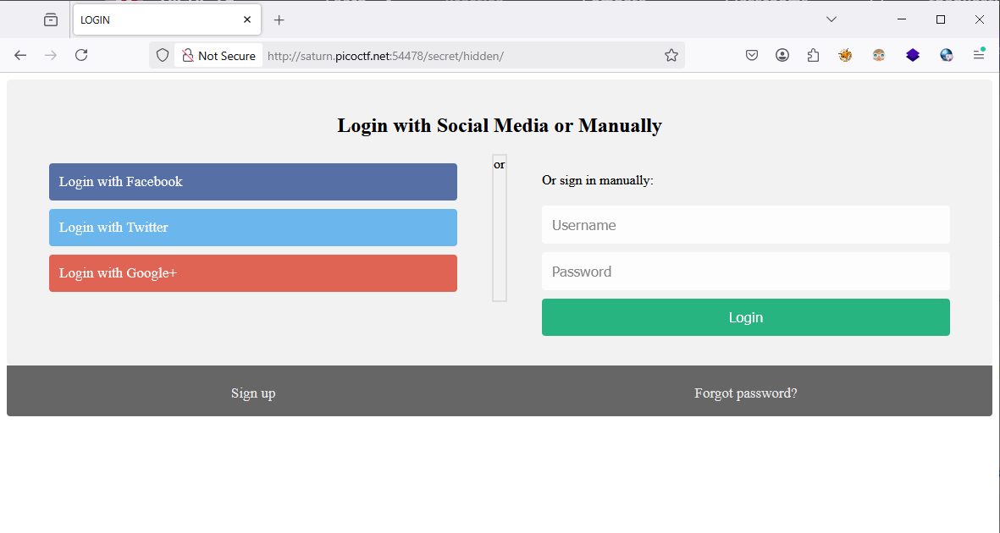
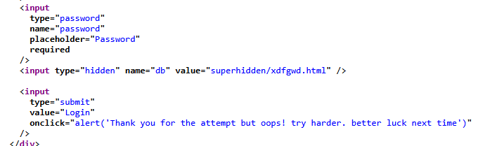
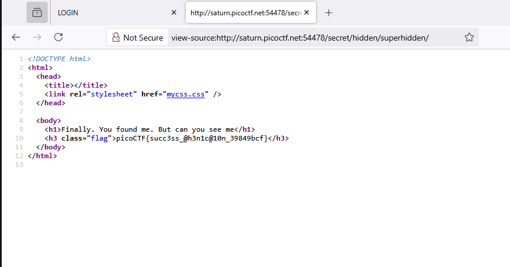

### Secrets Challenge 296

Access the lab, using dirsearch to find some clue, got `/secret/`

I found directory `hidden` storage static file

try access to `/secret/hidden`

view source this, we got another directory `superhidden`

Access to `secret/hidden/superhidden/` and `flag`

