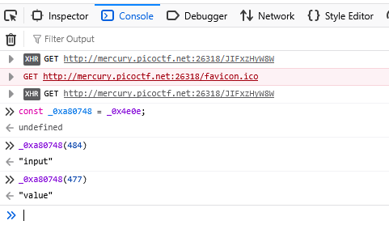
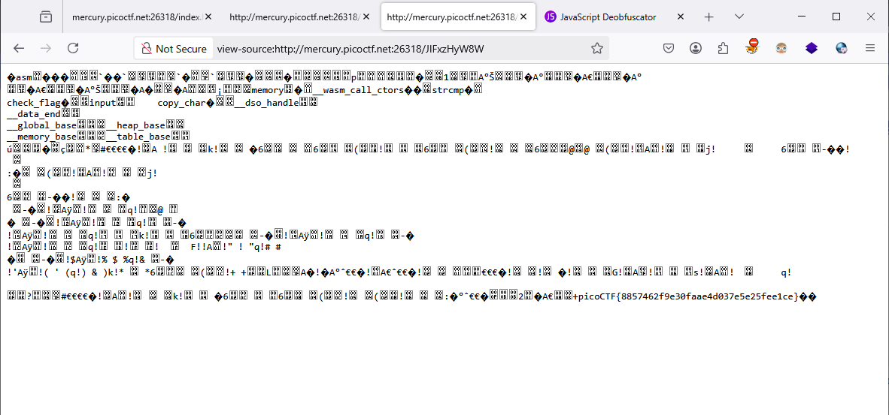

### Some Assembly Required 1  Challenge 152

Access the webpage, see `G82XCw5CX3.js`, this file was obfucated
```js
const _0x402c=['value','2wfTpTR','instantiate','275341bEPcme','innerHTML','1195047NznhZg','1qfevql','input','1699808QuoWhA','Correct!','check_flag','Incorrect!','./JIFxzHyW8W','23SMpAuA','802698XOMSrr','charCodeAt','474547vVoGDO','getElementById','instance','copy_char','43591XxcWUl','504454llVtzW','arrayBuffer','2NIQmVj','result'];const _0x4e0e=function(_0x553839,_0x53c021){_0x553839=_0x553839-0x1d6;let _0x402c6f=_0x402c[_0x553839];return _0x402c6f;};(function(_0x76dd13,_0x3dfcae){const _0x371ac6=_0x4e0e;while(!![]){try{const _0x478583=-parseInt(_0x371ac6(0x1eb))+parseInt(_0x371ac6(0x1ed))+-parseInt(_0x371ac6(0x1db))*-parseInt(_0x371ac6(0x1d9))+-parseInt(_0x371ac6(0x1e2))*-parseInt(_0x371ac6(0x1e3))+-parseInt(_0x371ac6(0x1de))*parseInt(_0x371ac6(0x1e0))+parseInt(_0x371ac6(0x1d8))*parseInt(_0x371ac6(0x1ea))+-parseInt(_0x371ac6(0x1e5));if(_0x478583===_0x3dfcae)break;else _0x76dd13['push'](_0x76dd13['shift']());}catch(_0x41d31a){_0x76dd13['push'](_0x76dd13['shift']());}}}(_0x402c,0x994c3));let exports;(async()=>{const _0x48c3be=_0x4e0e;let _0x5f0229=await fetch(_0x48c3be(0x1e9)),_0x1d99e9=await WebAssembly[_0x48c3be(0x1df)](await _0x5f0229[_0x48c3be(0x1da)]()),_0x1f8628=_0x1d99e9[_0x48c3be(0x1d6)];exports=_0x1f8628['exports'];})();function onButtonPress(){const _0xa80748=_0x4e0e;let _0x3761f8=document['getElementById'](_0xa80748(0x1e4))[_0xa80748(0x1dd)];for(let _0x16c626=0x0;_0x16c626<_0x3761f8['length'];_0x16c626++){exports[_0xa80748(0x1d7)](_0x3761f8[_0xa80748(0x1ec)](_0x16c626),_0x16c626);}exports['copy_char'](0x0,_0x3761f8['length']),exports[_0xa80748(0x1e7)]()==0x1?document[_0xa80748(0x1ee)](_0xa80748(0x1dc))[_0xa80748(0x1e1)]=_0xa80748(0x1e6):document[_0xa80748(0x1ee)](_0xa80748(0x1dc))[_0xa80748(0x1e1)]=_0xa80748(0x1e8);}
```

let deobfucate and beautify this js, i got

```js
const _0x402c = ["value", "2wfTpTR", "instantiate", "275341bEPcme", "innerHTML", "1195047NznhZg", "1qfevql", "input", "1699808QuoWhA", "Correct!", "check_flag", "Incorrect!", "./JIFxzHyW8W", "23SMpAuA", "802698XOMSrr", "charCodeAt", "474547vVoGDO", "getElementById", "instance", "copy_char", "43591XxcWUl", "504454llVtzW", "arrayBuffer", "2NIQmVj", "result"];
const _0x4e0e = function (_0x553839, _0x53c021) {
  _0x553839 = _0x553839 - 470;
  let _0x402c6f = _0x402c[_0x553839];
  return _0x402c6f;
};
(function (_0x76dd13, _0x3dfcae) {
  const _0x371ac6 = _0x4e0e;
  while (true) {
    try {
      const _0x478583 = -parseInt(_0x371ac6(491)) + parseInt(_0x371ac6(493)) + -parseInt(_0x371ac6(475)) * -parseInt(_0x371ac6(473)) + -parseInt(_0x371ac6(482)) * -parseInt(_0x371ac6(483)) + -parseInt(_0x371ac6(478)) * parseInt(_0x371ac6(480)) + parseInt(_0x371ac6(472)) * parseInt(_0x371ac6(490)) + -parseInt(_0x371ac6(485));
      if (_0x478583 === _0x3dfcae) break; else _0x76dd13.push(_0x76dd13.shift());
    } catch (_0x41d31a) {
      _0x76dd13.push(_0x76dd13.shift());
    }
  }
}(_0x402c, 627907));
let exports;
(async () => {
  const _0x48c3be = _0x4e0e;
  let _0x5f0229 = await fetch(_0x48c3be(489)), _0x1d99e9 = await WebAssembly[_0x48c3be(479)](await _0x5f0229[_0x48c3be(474)]()), _0x1f8628 = _0x1d99e9[_0x48c3be(470)];
  exports = _0x1f8628.exports;
})();
function onButtonPress() {
  const _0xa80748 = _0x4e0e;
  let _0x3761f8 = document.getElementById(_0xa80748(484))[_0xa80748(477)];
  for (let _0x16c626 = 0; _0x16c626 < _0x3761f8.length; _0x16c626++) {
    exports[_0xa80748(471)](_0x3761f8[_0xa80748(492)](_0x16c626), _0x16c626);
  }
  exports.copy_char(0, _0x3761f8.length), exports[_0xa80748(487)]() == 1 ? document[_0xa80748(494)](_0xa80748(476))[_0xa80748(481)] = _0xa80748(486) : document[_0xa80748(494)](_0xa80748(476))[_0xa80748(481)] = _0xa80748(488);
}
let total = 0;
for (let i = 0; i < 10; i++) {
  total += i;
}
console.log("Total: " + total);

```

so, the first line `const _0x402c` init a array, try to get decode it, open console develop of browser and try to decode, i focus on `let exports;`



now i know, `let _0x3761f8 = document.getElementById(_0xa80748(484))[_0xa80748(477)];` is `let _0x3761f8 = document.getElementById(input)[value];`,

next on, we got full decode

```js
let exports;
(async () => {
  const _0x48c3be = _0x4e0e;
  let _0x5f0229 = await fetch(`./JIFxzHyW8W`), _0x1d99e9 = await WebAssembly[instantiate](await _0x5f0229[arrayBuffer]()), _0x1f8628 = _0x1d99e9[instance];
  exports = _0x1f8628.exports;
})();
function onButtonPress() {
  const _0xa80748 = _0x4e0e;
  let _0x3761f8 = document.getElementById(input)[value];
  for (let _0x16c626 = 0; _0x16c626 < _0x3761f8.length; _0x16c626++) {
    exports[copy_char](_0x3761f8[charCodeAt](_0x16c626), _0x16c626);
  }
  exports.copy_char(0, _0x3761f8.length), exports[check_flag]() == 1 ? document[getElementById](getElementById)[innerHTML] = `Correct!` : document[getElementById](result)[innerHTML] = `Incorrect!`;
}
let total = 0;
for (let i = 0; i < 10; i++) {
  total += i;
}
console.log("Total: " + total);
```

i saw `./JIFxzHyW8W`, it's mean webserver try to fetch data from this




