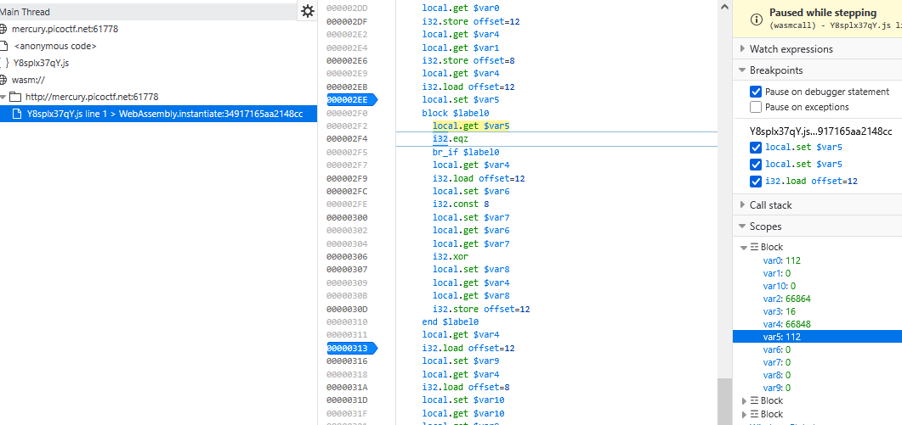
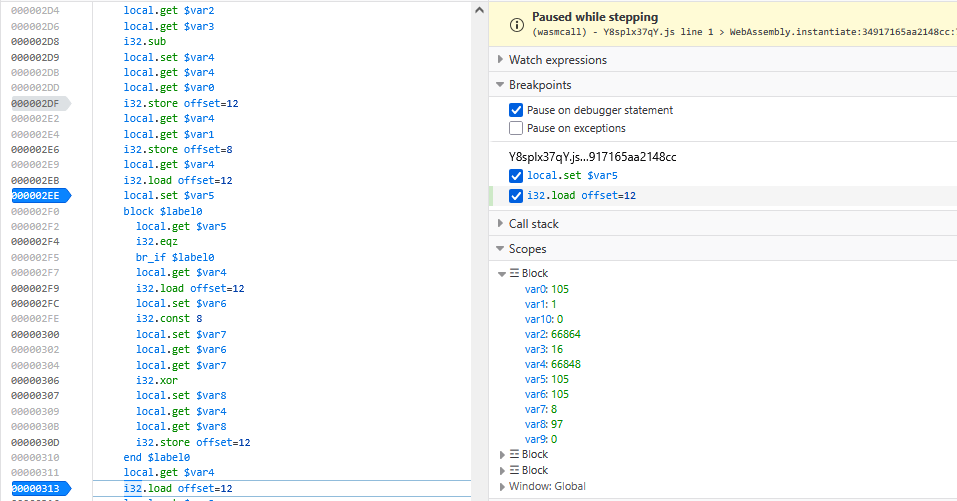

### Some Assembly Required 2 Challenge 131

Access the webpage, like [Some Assembly Required 1 exploit](<../Some Assembly Required 1/Some Assembly Required 1.md>)

i just focus on `fetch`, just decode it and saw js file, but flag was encoded

let debug js on `copy_char` cause this function using compare each char to validate `flag`

on `wasm` copy char, set debug point, we can see `var8` with 112, so we can check `112` is `p`, using `ord('p')^8` (8 is $var7 passed and betwent var7 and var8 is `xor`) got $var8 is `120`

so we can confirm `$var8` is `xor` of `$var7 with $var5`



next, check params `i` 



`$var8` is `97` so i think it using `xor` operator and save this result after `xor` to `1024` address

let [CyberChef](https://gchq.github.io/CyberChef/) with `xor brute force` with string encoded

```wasm
(module
  (table $table0 1 1 funcref)
  (memory $memory0 2)
  (global $global0 (mut i32) (i32.const 66864))
  (global $global1 i32 (i32.const 1072))
  (global $global2 i32 (i32.const 1024))
  (global $global3 i32 (i32.const 1328))
  (global $global4 i32 (i32.const 1024))
  (global $global5 i32 (i32.const 66864))
  (global $global6 i32 (i32.const 0))
  (global $global7 i32 (i32.const 1))
  (export "memory" (memory $memory0))
  (export "__wasm_call_ctors" (func $func0))
  (export "strcmp" (func $func1))
  (export "check_flag" (func $func2))
  (export "input" (global $global1))
  (export "copy_char" (func $func3))
  (export "__dso_handle" (global $global2))
  (export "__data_end" (global $global3))
  (export "__global_base" (global $global4))
  (export "__heap_base" (global $global5))
  (export "__memory_base" (global $global6))
  (export "__table_base" (global $global7))
  (func $func0
  )
  (func $func1 (param $var0 i32) (param $var1 i32) (result i32)
    (local $var2 i32) (local $var3 i32) (local $var4 i32) (local $var5 i32) (local $var6 i32) (local $var7 i32) (local $var8 i32) (local $var9 i32) (local $var10 i32) (local $var11 i32) (local $var12 i32) (local $var13 i32) (local $var14 i32) (local $var15 i32) (local $var16 i32) (local $var17 i32) (local $var18 i32) (local $var19 i32) (local $var20 i32) (local $var21 i32) (local $var22 i32) (local $var23 i32) (local $var24 i32) (local $var25 i32) (local $var26 i32) (local $var27 i32) (local $var28 i32) (local $var29 i32) (local $var30 i32) (local $var31 i32) (local $var32 i32) (local $var33 i32) (local $var34 i32) (local $var35 i32) (local $var36 i32) (local $var37 i32) (local $var38 i32) (local $var39 i32) (local $var40 i32) (local $var41 i32) (local $var42 i32) (local $var43 i32)
    global.get $global0
    local.set $var2
    i32.const 32
    local.set $var3
    local.get $var2
    local.get $var3
    i32.sub
    local.set $var4
    local.get $var4
    local.get $var0
    i32.store offset=24
    local.get $var4
    local.get $var1
    i32.store offset=20
    local.get $var4
    i32.load offset=24
    local.set $var5
    local.get $var4
    local.get $var5
    i32.store offset=16
    local.get $var4
    i32.load offset=20
    local.set $var6
    local.get $var4
    local.get $var6
    i32.store offset=12
    block $label1
      loop $label2
        local.get $var4
        i32.load offset=16
        local.set $var7
        i32.const 1
        local.set $var8
        local.get $var7
        local.get $var8
        i32.add
        local.set $var9
        local.get $var4
        local.get $var9
        i32.store offset=16
        local.get $var7
        i32.load8_u
        local.set $var10
        local.get $var4
        local.get $var10
        i32.store8 offset=11
        local.get $var4
        i32.load offset=12
        local.set $var11
        i32.const 1
        local.set $var12
        local.get $var11
        local.get $var12
        i32.add
        local.set $var13
        local.get $var4
        local.get $var13
        i32.store offset=12
        local.get $var11
        i32.load8_u
        local.set $var14
        local.get $var4
        local.get $var14
        i32.store8 offset=10
        local.get $var4
        i32.load8_u offset=11
        local.set $var15
        i32.const 255
        local.set $var16
        local.get $var15
        local.get $var16
        i32.and
        local.set $var17
        block $label0
          local.get $var17
          br_if $label0
          local.get $var4
          i32.load8_u offset=11
          local.set $var18
          i32.const 255
          local.set $var19
          local.get $var18
          local.get $var19
          i32.and
          local.set $var20
          local.get $var4
          i32.load8_u offset=10
          local.set $var21
          i32.const 255
          local.set $var22
          local.get $var21
          local.get $var22
          i32.and
          local.set $var23
          local.get $var20
          local.get $var23
          i32.sub
          local.set $var24
          local.get $var4
          local.get $var24
          i32.store offset=28
          br $label1
        end $label0
        local.get $var4
        i32.load8_u offset=11
        local.set $var25
        i32.const 255
        local.set $var26
        local.get $var25
        local.get $var26
        i32.and
        local.set $var27
        local.get $var4
        i32.load8_u offset=10
        local.set $var28
        i32.const 255
        local.set $var29
        local.get $var28
        local.get $var29
        i32.and
        local.set $var30
        local.get $var27
        local.set $var31
        local.get $var30
        local.set $var32
        local.get $var31
        local.get $var32
        i32.eq
        local.set $var33
        i32.const 1
        local.set $var34
        local.get $var33
        local.get $var34
        i32.and
        local.set $var35
        local.get $var35
        br_if $label2
      end $label2
      local.get $var4
      i32.load8_u offset=11
      local.set $var36
      i32.const 255
      local.set $var37
      local.get $var36
      local.get $var37
      i32.and
      local.set $var38
      local.get $var4
      i32.load8_u offset=10
      local.set $var39
      i32.const 255
      local.set $var40
      local.get $var39
      local.get $var40
      i32.and
      local.set $var41
      local.get $var38
      local.get $var41
      i32.sub
      local.set $var42
      local.get $var4
      local.get $var42
      i32.store offset=28
    end $label1
    local.get $var4
    i32.load offset=28
    local.set $var43
    local.get $var43
    return
  )
  (func $func2 (result i32)
    (local $var0 i32) (local $var1 i32) (local $var2 i32) (local $var3 i32) (local $var4 i32) (local $var5 i32) (local $var6 i32) (local $var7 i32) (local $var8 i32) (local $var9 i32) (local $var10 i32)
    i32.const 0
    local.set $var0
    i32.const 1072
    local.set $var1
    i32.const 1024
    local.set $var2
    local.get $var2
    local.get $var1
    call $func1
    local.set $var3
    local.get $var3
    local.set $var4
    local.get $var0
    local.set $var5
    local.get $var4
    local.get $var5
    i32.ne
    local.set $var6
    i32.const -1
    local.set $var7
    local.get $var6
    local.get $var7
    i32.xor
    local.set $var8
    i32.const 1
    local.set $var9
    local.get $var8
    local.get $var9
    i32.and
    local.set $var10
    local.get $var10
    return
  )
  (func $func3 (param $var0 i32) (param $var1 i32)
    (local $var2 i32) (local $var3 i32) (local $var4 i32) (local $var5 i32) (local $var6 i32) (local $var7 i32) (local $var8 i32) (local $var9 i32) (local $var10 i32)
    global.get $global0
    local.set $var2
    i32.const 16
    local.set $var3
    local.get $var2
    local.get $var3
    i32.sub
    local.set $var4
    local.get $var4
    local.get $var0
    i32.store offset=12
    local.get $var4
    local.get $var1
    i32.store offset=8
    local.get $var4
    i32.load offset=12
    local.set $var5
    block $label0
      local.get $var5
      i32.eqz
      br_if $label0
      local.get $var4
      i32.load offset=12
      local.set $var6
      i32.const 8
      local.set $var7
      local.get $var6
      local.get $var7
      i32.xor
      local.set $var8
      local.get $var4
      local.get $var8
      i32.store offset=12
    end $label0
    local.get $var4
    i32.load offset=12
    local.set $var9
    local.get $var4
    i32.load offset=8
    local.set $var10
    local.get $var10
    local.get $var9
    i32.store8 offset=1072
    return
  )
  (data (i32.const 1024) "xakgK\5cNs((j:l9<mimk?:k;9;8=8?=0?>jnn:j=lu\00\00")
)
```

go `cyberchef.io`, let `XOR Brute Force` string data, we got flag

