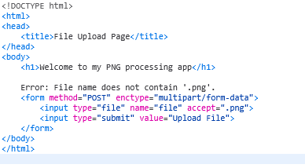
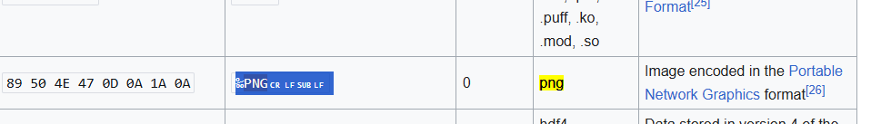
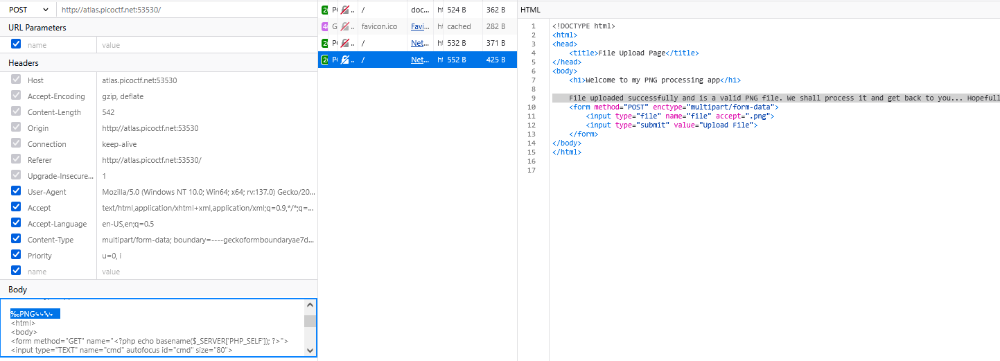
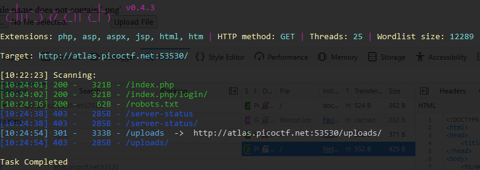
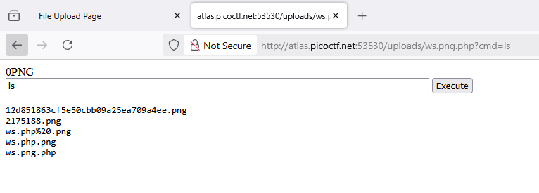
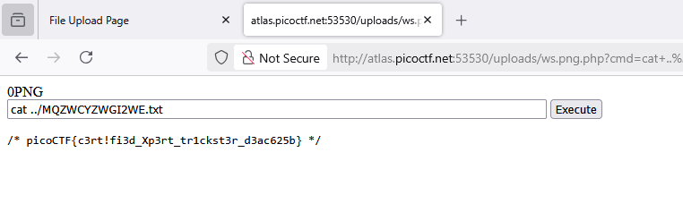

### Trickster | Challenge 445

Access the lab, only upload functions

It's just accept only .png

so we trying using `magic bytes png` and change the name of file `ws.png.php` to POST file

Magic bytes:

Upload with new `Magic bytes` and named `ws.png.php`, bypassed

Next, using `dirsearch` to crawl `end point`, we found:

Founded `robots.txt` with 200 and `uploads` - 403 Forbidden

So, guess this file uploaded on `uploads/`

try go to `{hostname}/uploads/ws.png.php`, in shell

But `ls`, don't have anythings

try `ls ../`, saw text file `MQZWCYZWGI2WE.txt`, try `cat MQZWCYZWGI2WE.txt`

