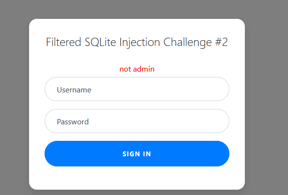
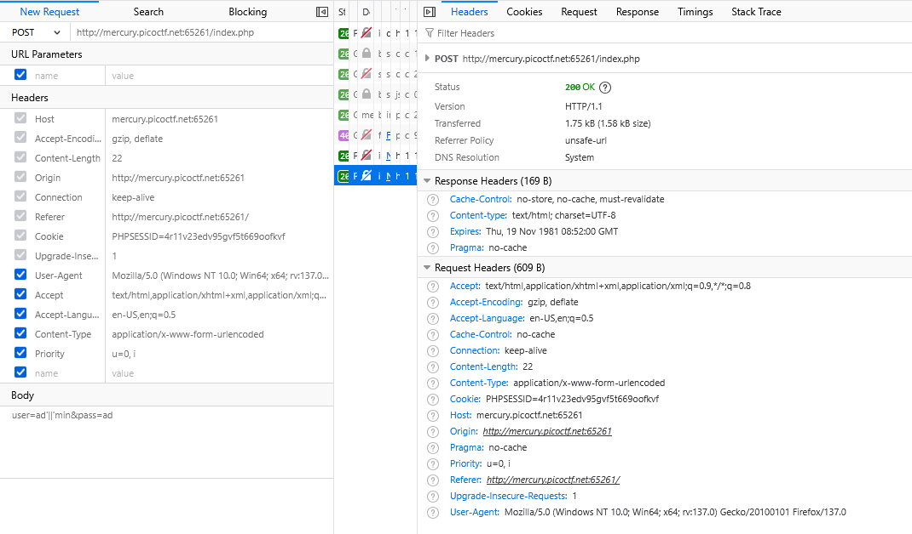
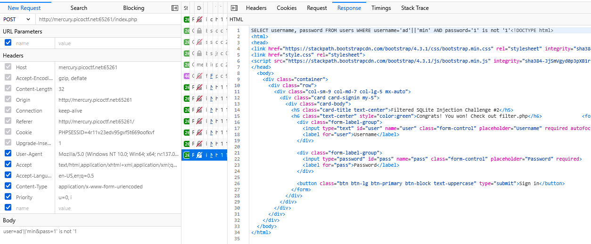
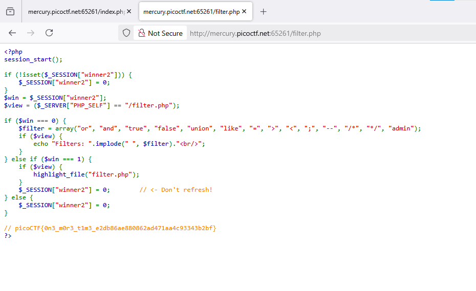

### Web Gauntlet 2 Challenge 174

Access the lab, SQL injection filterd #2, so confirm it SQL Injection but filterd,



Go check `/filtered.php`, we got something block:

```php
Filters: or and true false union like = > < ; -- /* */ admin
```
so we can not using basic payload like `or 1=1 or union or smt`

Let's bypass this. we can using join `||` to concatenation 2 string



ok response `not admin`, it's mean join not to be blocked

but `or` not using here, so, using `not` operator to bypass this. `is not` to compare with `NULL`, so when compre `1 is not 1` always true

try payload `user=ad'||'min&pass=1' is not '1`, 



win, chekc the filter to get `flag`

