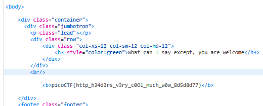

### Who are you Challenge 142

Access the webpage

it's say must using PicoBrowser, try to modify `UserAgent`,

after sent request, it's say

```html
		<div class="row">
			<div class="col-xs-12 col-sm-12 col-md-12">
				<h3 style="color:red">I don&#39;t trust users visiting from another site.</h3>
			</div>
		</div>
```

try to sent request with `Referer` (Referer make your last visited is a url i want) is `url` this web

```html
		<div class="row">
			<div class="col-xs-12 col-sm-12 col-md-12">
				<h3 style="color:red">Sorry, this site only worked in 2018.</h3>
			</div>
		</div>
```

so, it's say work only 2018, sent request with `date: 2018`

```html
		<div class="row">
			<div class="col-xs-12 col-sm-12 col-md-12">
				<h3 style="color:red">I don&#39;t trust users who can be tracked.</h3>
			</div>
		</div>
```
Next, this web don't trust user who can be tracked, sent request with `DNT` (Do-not-track header) with value `true`

```html
		<div class="row">
			<div class="col-xs-12 col-sm-12 col-md-12">
				<h3 style="color:red">This website is only for people from Sweden.</h3>
			</div>
		</div>
```
yea, got website for only sweden, so sent request with `X-My-Country: SE` but it not work

Try other header like `X-Forwarded-For` with [Sweden_IP](https://lite.ip2location.com/sweden-ip-address-ranges?lang=en_US)

```html
		<div class="row">
			<div class="col-xs-12 col-sm-12 col-md-12">
				<h3 style="color:red">You&#39;re in Sweden but you don&#39;t speak Swedish?</h3>
			</div>
		</div>
```

Don't sepak Swedish? yea sure, go sent request with `Accept-Language: sv-SE`, we got flag



so try to write a script to get this flag
