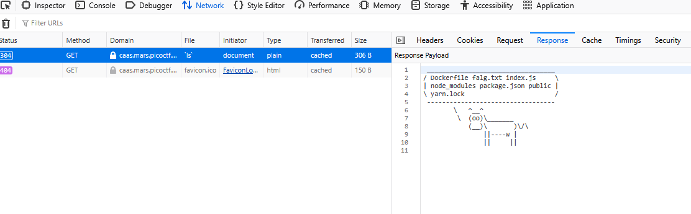
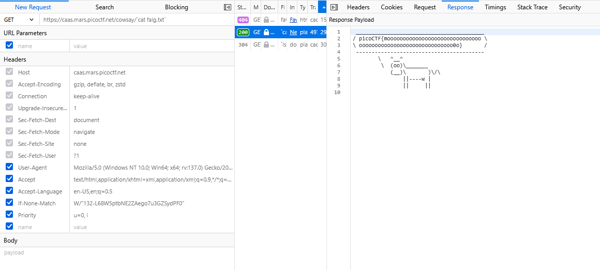

### caas Challenge 202

Acces the lab, nothing here

download `index.js`, some clue here

```js
//web-exploitation/medium/caas/index.js:7-8
app.get('/cowsay/:message', (req, res) => {
  exec(`/usr/games/cowsay ${req.params.message}`, {timeout: 5000}, (error, stdout) => {
    if (error) return res.status(500).end();
    res.type('txt').send(stdout).end();
  });
});
```

May be got os command injection cause it using `exec` function

Let's exploit it

using `ls`



got `flag`, try cat it

