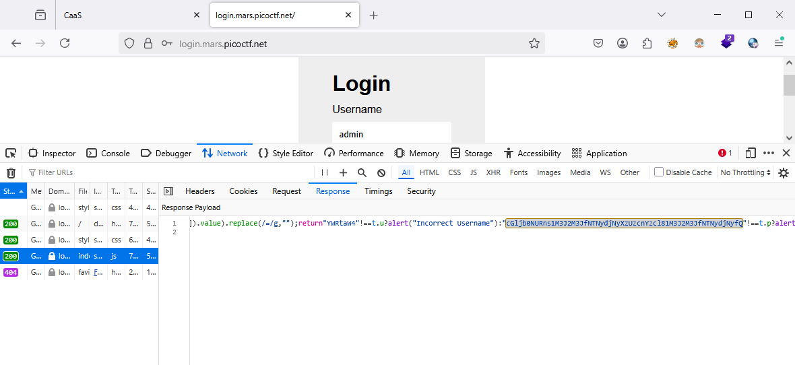
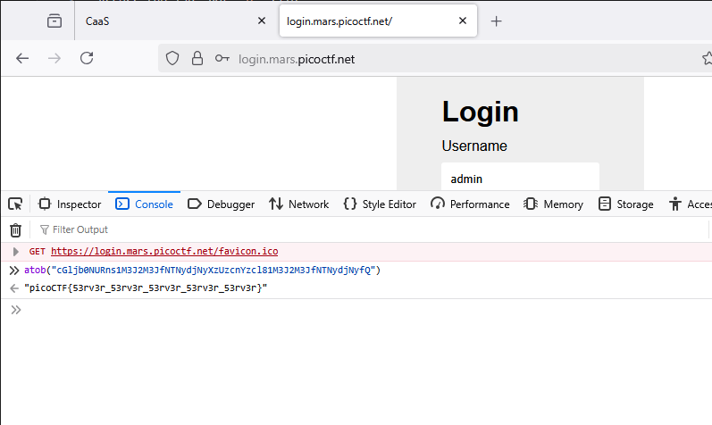

### Login Challenge 200

Access the lab, got `js` file



```js
(async () => {
    await new Promise(((resolve) => window.addEventListener("load", resolve)));
    
    document.querySelector("form").addEventListener("submit", ((event) => {
        event.preventDefault();
        
        const selectors = {
            u: "input[name=username]",
            p: "input[name=password]"
        };
        
        const values = {};
        
        for (const key in selectors) {
            values[key] = btoa(document.querySelector(selectors[key]).value).replace(/=/g, "");
        }
        
        if ("YWRtaW4" !== values.u) {
            alert("Incorrect Username");
        } else if ("cGljb0NURns1M3J2M3JfNTNydjNyXzUzcnYzcl81M3J2M3JfNTNydjNyfQ" !== values.p) {
            alert("Incorrect Password");
        } else {
            alert(`Correct Password! Your flag is ${atob(values.p)}.`);
        }
    }));
})();
```
After beauty code we got correct password is `cGljb0NURns1M3J2M3JfNTNydjNyXzUzcnYzcl81M3J2M3JfNTNydjNyfQ` and flag is base 64 it


base64 decode, got `flag?`



