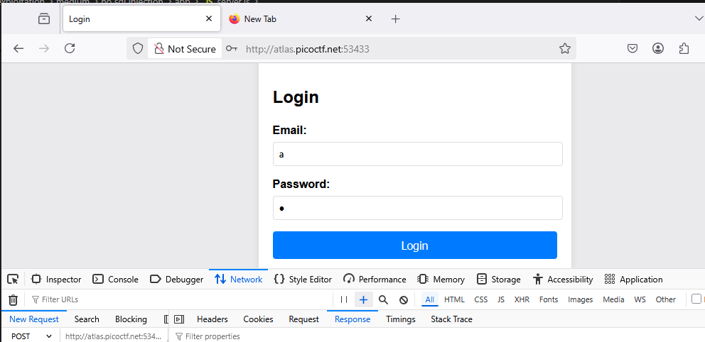
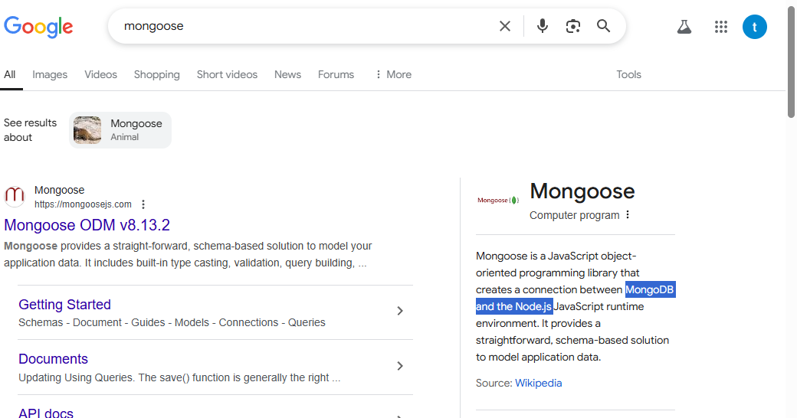
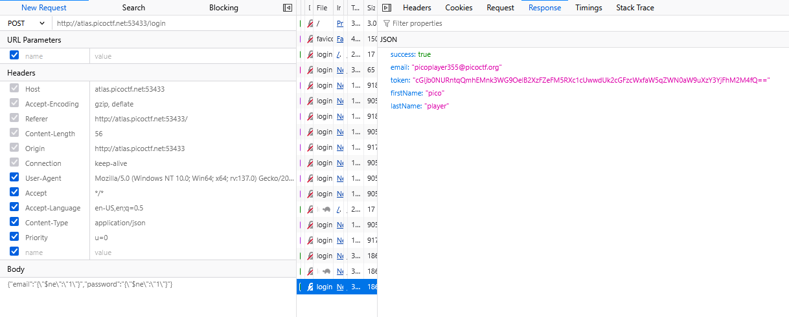
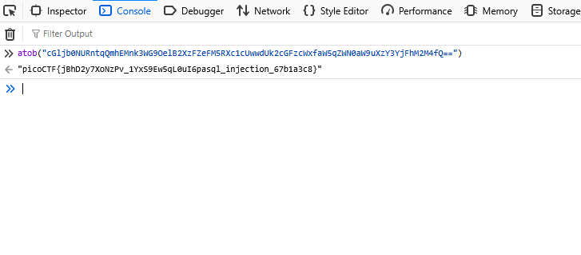

### non sql injection


Access the lab,



Download source, at `server.js(53-66)`, Specifically, the use of JSON.parse on user-provided input allows attackers to inject malicious JSON objects into the query, potentially bypassing authentication or accessing unauthorized data.

```js
    app.post("/login", async (req, res) => {
      const { email, password } = req.body;

      try {
        const user = await User.findOne({
          email:
            email.startsWith("{") && email.endsWith("}")
              ? JSON.parse(email)
              : email,
          password:
            password.startsWith("{") && password.endsWith("}")
              ? JSON.parse(password)
              : password,
        });
```

Google `mongooes`, it's `non SQL` 



Try some payload `non SQL injection` at [nonsql](https://portswigger.net/web-security/nosql-injection)

get the flag, flag base64



